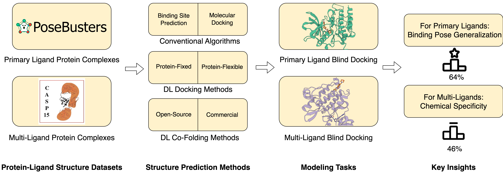

<div align="center">

# PoseBench

[](https://arxiv.org/abs/2405.14108)
[](https://doi.org/10.5281/zenodo.16791095)
[](https://badge.fury.io/py/posebench)
[](https://www.repostatus.org/#active)
[](https://bioinfomachinelearning.github.io/PoseBench/)
<a href="https://hydra.cc/"></a>
<a href="https://github.com/psf/black"></a>
[](https://opensource.org/licenses/MIT)
[](https://huggingface.co/papers/2405.14108)



</div>

## Description

Comprehensive benchmarking of protein-ligand structure prediction methods

[Documentation](https://bioinfomachinelearning.github.io/PoseBench/)

## Contents

- [Installation](#installation)
- [Tutorials](#tutorials)
- [How to prepare PoseBench data](#how-to-prepare-posebench-data)
- [Available inference methods](#available-inference-methods)
- [How to run a sweep of benchmarking experiments](#how-to-run-a-sweep-of-benchmarking-experiments)
- [How to run inference with individual methods](#how-to-run-inference-with-individual-methods)
- [How to run inference with a method ensemble](#how-to-run-inference-with-a-method-ensemble)
- [How to create comparative plots of inference results](#how-to-create-comparative-plots-of-inference-results)
- [For developers](#for-developers)
- [Acknowledgements](#acknowledgements)
- [Citing this work](#citing-this-work)
- [Bonus](#bonus)

## Installation

<details>

### Portable installation

To reuse modules and utilities within `PoseBench` in other projects, one can simply use `pip`

```bash
pip install posebench
```

### Full installation

To reproduce, customize, or extend the `PoseBench` benchmark, we recommend fully installing `PoseBench` using `mamba` as follows:

First, install `mamba` for dependency management (as a fast alternative to Anaconda)

```bash
wget "https://github.com/conda-forge/miniforge/releases/download/24.11.3-0/Miniforge3-$(uname)-$(uname -m).sh"
bash Miniforge3-$(uname)-$(uname -m).sh  # accept all terms and install to the default location
rm Miniforge3-$(uname)-$(uname -m).sh  # (optionally) remove installer after using it
source ~/.bashrc  # alternatively, one can restart their shell session to achieve the same result
```

Install dependencies for each method's environment (as desired)

```bash
# clone project
sudo apt-get install git-lfs  # NOTE: run this if you have not already installed `git-lfs`
git lfs install
git clone https://github.com/BioinfoMachineLearning/PoseBench --recursive
cd PoseBench

# create conda environments (~80 GB total)
# - PoseBench environment # (~15 GB)
mamba env create -f environments/posebench_environment.yaml
conda activate PoseBench  # NOTE: one still needs to use `conda` to (de)activate environments
pip3 install -e .
pip3 install numpy==1.26.4 --no-dependencies
pip3 install prody==2.4.1 --no-dependencies
# - PyMOL environment # (~1 GB)
mamba env create -f environments/pymol_environment.yaml
conda activate PyMOL-PoseBench
pip install -e . --no-deps
# - casp15_ligand_scoring environment (~3 GB)
mamba env create -f environments/casp15_ligand_scoring_environment.yaml
conda activate casp15_ligand_scoring  # NOTE: one still needs to use `conda` to (de)activate environments
# NOTE: must comment out the `posecheck` requirement in `pyproject.toml` beforehand and restore it thereafter
pip3 install -e .
# - DiffDock environment (~13 GB)
mamba env create -f environments/diffdock_environment.yaml --prefix forks/DiffDock/DiffDock/
conda activate forks/DiffDock/DiffDock/  # NOTE: one still needs to use `conda` to (de)activate environments
pip3 install pyg-lib -f https://data.pyg.org/whl/torch-2.1.0+cu118.html
# - FABind environment (~6 GB)
mamba env create -f environments/fabind_environment.yaml --prefix forks/FABind/FABind/
conda activate forks/FABind/FABind/  # NOTE: one still needs to use `conda` to (de)activate environments
# - DynamicBind environment (~13 GB)
mamba env create -f environments/dynamicbind_environment.yaml --prefix forks/DynamicBind/DynamicBind/
conda activate forks/DynamicBind/DynamicBind/ && pip3 install pyg-lib -f https://data.pyg.org/whl/torch-2.1.0+cu118.html  # NOTE: one still needs to use
# - NeuralPLexer environment (~14 GB)
mamba env create -f environments/neuralplexer_environment.yaml --prefix forks/NeuralPLexer/NeuralPLexer/
conda activate forks/NeuralPLexer/NeuralPLexer/  # NOTE: one still needs to use `conda` to (de)activate environments
cd forks/NeuralPLexer/ && pip3 install -e . && cd ../../
# - FlowDock environment (~14 GB)
mamba env create -f environments/flowdock_environment.yaml --prefix forks/FlowDock/FlowDock/
conda activate forks/FlowDock/FlowDock/  # NOTE: one still needs to use `conda` to (de)activate environments
cd forks/FlowDock/ && pip3 install -e . && cd ../../
# - RoseTTAFold-All-Atom environment (~14 GB) - NOTE: after running these commands, follow the installation instructions in `forks/RoseTTAFold-All-Atom/README.md` starting at Step 4 (with `forks/RoseTTAFold-All-Atom/` as the current working directory)
mamba env create -f environments/rfaa_environment.yaml --prefix forks/RoseTTAFold-All-Atom/RFAA/
conda activate forks/RoseTTAFold-All-Atom/RFAA/  # NOTE: one still needs to use `conda` to (de)activate environments
cd forks/RoseTTAFold-All-Atom/rf2aa/SE3Transformer/ && pip3 install --no-cache-dir -r requirements.txt && python3 setup.py install && cd ../../../../
# - Chai-1 environment (~6 GB)
mamba env create -f environments/chai_lab_environment.yaml --prefix forks/chai-lab/chai-lab/
conda activate forks/chai-lab/chai-lab/  # NOTE: one still needs to use `conda` to (de)activate environments
pip3 install forks/chai-lab/
# - Boltz environment (~5 GB)
mamba env create -f environments/boltz_environment.yaml --prefix forks/boltz/boltz/
conda activate forks/boltz/boltz/  # NOTE: one still needs to use `conda` to (de)activate environments
cd forks/boltz/ && pip3 install -e .[cuda] && cd ../../
# - AutoDock Vina Tools environment (~1 GB)
mamba env create -f environments/adfr_environment.yaml --prefix forks/Vina/ADFR/
conda activate forks/Vina/ADFR/  # NOTE: one still needs to use `conda` to (de)activate environments
# - P2Rank (~0.5 GB)
wget -P forks/P2Rank/ https://github.com/rdk/p2rank/releases/download/2.4.2/p2rank_2.4.2.tar.gz
tar -xzf forks/P2Rank/p2rank_2.4.2.tar.gz -C forks/P2Rank/
rm forks/P2Rank/p2rank_2.4.2.tar.gz
```

Download checkpoints (~8.25 GB total)

```bash
# DynamicBind checkpoint (~0.25 GB)
cd forks/DynamicBind/
wget https://zenodo.org/records/10137507/files/workdir.zip
unzip workdir.zip
rm workdir.zip
cd ../../

# NeuralPLexer checkpoint (~6.5 GB)
cd forks/NeuralPLexer/
wget https://zenodo.org/records/10373581/files/neuralplexermodels_downstream_datasets_predictions.zip
unzip neuralplexermodels_downstream_datasets_predictions.zip
rm neuralplexermodels_downstream_datasets_predictions.zip
cd ../../

# FlowDock checkpoint (~2 GB)
cd forks/FlowDock/
wget https://zenodo.org/records/14478459/files/flowdock_checkpoints.tar.gz
tar -xzf flowdock_checkpoints.tar.gz
rm flowdock_checkpoints.tar.gz
cd ../../

# RoseTTAFold-All-Atom checkpoint (~1.5 GB)
cd forks/RoseTTAFold-All-Atom/
wget http://files.ipd.uw.edu/pub/RF-All-Atom/weights/RFAA_paper_weights.pt
cd ../../
```

(Optional) Download PLINDER-based similarity metrics for method generalization analysis (~0.5 GB total)

```bash
mkdir -p ./data/plinder/
wget -P ./data/plinder/ https://zenodo.org/records/16754298/files/annotations.csv
wget -P ./data/plinder/ https://zenodo.org/records/16754298/files/all_similarity_scores.parquet
```

(Optional) Alternatively, download PLINDER to perform a method generalization analysis for custom (new) datasets (~500 GB total)

```bash
# download fixed version of PLINDER
export PLINDER_RELEASE=2024-06
export PLINDER_ITERATION=v2
mkdir -p ./data/plinder/${PLINDER_RELEASE}/${PLINDER_ITERATION}/
gsutil -m cp -r "gs://plinder/${PLINDER_RELEASE}/${PLINDER_ITERATION}/*" ./data/plinder/${PLINDER_RELEASE}/${PLINDER_ITERATION}/

# unpack system files of fixed version of PLINDER
cd ./data/plinder/${PLINDER_RELEASE}/${PLINDER_ITERATION}/systems; for i in `ls *zip`; do unzip $i; touch ${i//.zip/}_done; done
cd ../../../../../

# customize `similarity_scoring.py` to similarity-match a (bespoke) subset of new PDB complex IDs for (blind) benchmarking
python3 posebench/analysis/similarity_scoring.py $PDB_ID_FROM_NEW_SUBSET # e.g., in a for-loop or in parallel

# combine each score of the new subset into a singular (new) `all_similarity_scores.parquet` file
python3 -c "import os, pandas as pd; from glob import glob; files = glob(os.path.join('scoring', 'scores', 'scores', 'all_scores', '*.parquet')); pd.concat([pd.read_parquet(f) for f in files], ignore_index=True).to_parquet('data', 'plinder', 'all_similarity_scores.parquet')"

# update annotations
python3 -c "import re; pdb_ids_pattern = '|'.join(map(re.escape, $PDB_IDS_IN_NEW_SUBSET)); similarity_df_custom = all_similarity_scores[~all_similarity_scores["target_system"].str.contains(pdb_ids_pattern, na=False)].sort_values(by='sucos_shape_pocket_qcov', ascending=False).groupby('group_key').head(1).reset_index(drop=True); similarity_custom = dict(zip(similarity_df_custom['group_key'], similarity_df_custom['sucos_shape_pocket_qcov'])); annotated_df['sucos_shape_pocket_qcov_custom'] = annotated_df['group_key'].map(similarity_custom); annotated_df.to_csv(os.path.join('data', 'plinder', 'annotations.csv'))"
```

</details>

## Tutorials

<details>

We provide a two-part tutorial series of Jupyter notebooks to provide users with examples
of how to extend `PoseBench`, as outlined below.

1. [Adding a new dataset](https://github.com/BioinfoMachineLearning/PoseBench/blob/main/notebooks/adding_new_dataset_tutorial.ipynb)
2. [Adding a new method](https://github.com/BioinfoMachineLearning/PoseBench/blob/main/notebooks/adding_new_method_tutorial.ipynb)

</details>

## How to prepare `PoseBench` data

<details>

### Downloading Astex, PoseBusters, DockGen, and CASP15 data

```bash
# fetch, extract, and clean-up preprocessed Astex Diverse, PoseBusters Benchmark, DockGen, and CASP15 data (~3 GB) #
wget https://zenodo.org/records/16791095/files/astex_diverse_set.tar.gz
wget https://zenodo.org/records/16791095/files/posebusters_benchmark_set.tar.gz
wget https://zenodo.org/records/16791095/files/dockgen_set.tar.gz
wget https://zenodo.org/records/16791095/files/casp15_set.tar.gz
tar -xzf astex_diverse_set.tar.gz
tar -xzf posebusters_benchmark_set.tar.gz
tar -xzf dockgen_set.tar.gz
tar -xzf casp15_set.tar.gz
rm astex_diverse_set.tar.gz
rm posebusters_benchmark_set.tar.gz
rm dockgen_set.tar.gz
rm casp15_set.tar.gz
```

### Downloading benchmark method predictions

```bash
# fetch, extract, and clean-up benchmark method predictions to reproduce paper results (~19 GB) #
# AutoDock Vina predictions and results
wget https://zenodo.org/records/16791095/files/vina_benchmark_method_predictions.tar.gz
tar -xzf vina_benchmark_method_predictions.tar.gz
rm vina_benchmark_method_predictions.tar.gz
# DiffDock predictions and results
wget https://zenodo.org/records/16791095/files/diffdock_benchmark_method_predictions.tar.gz
tar -xzf diffdock_benchmark_method_predictions.tar.gz
rm diffdock_benchmark_method_predictions.tar.gz
# DynamicBind predictions and results
wget https://zenodo.org/records/16791095/files/dynamicbind_benchmark_method_predictions.tar.gz
tar -xzf dynamicbind_benchmark_method_predictions.tar.gz
rm dynamicbind_benchmark_method_predictions.tar.gz
# NeuralPLexer predictions and results
wget https://zenodo.org/records/16791095/files/neuralplexer_benchmark_method_predictions.tar.gz
tar -xzf neuralplexer_benchmark_method_predictions.tar.gz
rm neuralplexer_benchmark_method_predictions.tar.gz
# RoseTTAFold-All-Atom predictions and results
wget https://zenodo.org/records/16791095/files/rfaa_benchmark_method_predictions.tar.gz
tar -xzf rfaa_benchmark_method_predictions.tar.gz
rm rfaa_benchmark_method_predictions.tar.gz
# Chai-1 predictions and results
wget https://zenodo.org/records/16791095/files/chai_benchmark_method_predictions.tar.gz
tar -xzf chai_benchmark_method_predictions.tar.gz
rm chai_benchmark_method_predictions.tar.gz
# Boltz-1 predictions and results
wget https://zenodo.org/records/16791095/files/boltz_benchmark_method_predictions.tar.gz
tar -xzf boltz_benchmark_method_predictions.tar.gz
rm boltz_benchmark_method_predictions.tar.gz
# AlphaFold 3 predictions and results
wget https://zenodo.org/records/16791095/files/af3_benchmark_method_predictions.tar.gz
tar -xzf af3_benchmark_method_predictions.tar.gz
rm af3_benchmark_method_predictions.tar.gz
# CASP15 predictions and results for all methods
wget https://zenodo.org/records/16791095/files/casp15_benchmark_method_predictions.tar.gz
tar -xzf casp15_benchmark_method_predictions.tar.gz
rm casp15_benchmark_method_predictions.tar.gz
```

### Downloading benchmark method interactions

```bash
# fetch, extract, and clean-up benchmark method interactions to reproduce paper results (~12 GB) #
# cached ProLIF interactions for notebook plots
wget https://zenodo.org/records/16791095/files/posebench_notebooks.tar.gz
tar -xzf posebench_notebooks.tar.gz
rm posebench_notebooks.tar.gz
```

### Downloading sequence databases (required only for RoseTTAFold-All-Atom inference)

```bash
# acquire multiple sequence alignment databases for RoseTTAFold-All-Atom (~2.5 TB)
cd forks/RoseTTAFold-All-Atom/

# uniref30 [46G]
wget http://wwwuser.gwdg.de/~compbiol/uniclust/2020_06/UniRef30_2020_06_hhsuite.tar.gz
mkdir -p UniRef30_2020_06
tar xfz UniRef30_2020_06_hhsuite.tar.gz -C ./UniRef30_2020_06

# BFD [272G]
wget https://bfd.mmseqs.com/bfd_metaclust_clu_complete_id30_c90_final_seq.sorted_opt.tar.gz
mkdir -p bfd
tar xfz bfd_metaclust_clu_complete_id30_c90_final_seq.sorted_opt.tar.gz -C ./bfd

# structure templates [81G] (including *_a3m.ffdata, *_a3m.ffindex)
wget https://files.ipd.uw.edu/pub/RoseTTAFold/pdb100_2021Mar03.tar.gz
tar xfz pdb100_2021Mar03.tar.gz

cd ../../
```

### Downloading PDB metadata

```bash
# download and extract the PDB's FASTA sequence files
mkdir -p ./data/pdb_data/
wget -P ./data/pdb_data/ https://files.rcsb.org/pub/pdb/derived_data/pdb_seqres.txt.gz
find ./data/pdb_data/ -type f -name "*.gz" -exec gzip -d {} \;
```

### Predicting apo protein structures using ESMFold (optional, preprocessed data available)

First create all the corresponding FASTA files for each protein sequence

```bash
python3 posebench/data/components/fasta_preparation.py dataset=posebusters_benchmark
python3 posebench/data/components/fasta_preparation.py dataset=astex_diverse
python3 posebench/data/components/fasta_preparation.py dataset=dockgen
python3 posebench/data/components/fasta_preparation.py dataset=casp15
```

To generate the apo version of each protein structure,
create ESMFold-ready versions of the combined FASTA files
prepared above by the script `fasta_preparation.py`
for the PoseBusters Benchmark and Astex Diverse sets, respectively

```bash
python3 posebench/data/components/esmfold_sequence_preparation.py dataset=posebusters_benchmark
python3 posebench/data/components/esmfold_sequence_preparation.py dataset=astex_diverse
python3 posebench/data/components/esmfold_sequence_preparation.py dataset=dockgen
python3 posebench/data/components/esmfold_sequence_preparation.py dataset=casp15
```

Then, predict each apo protein structure using ESMFold's batch
inference script

```bash
python3 posebench/data/components/esmfold_batch_structure_prediction.py -i data/posebusters_benchmark_set/reference_posebusters_benchmark_esmfold_sequences.fasta -o data/posebusters_benchmark_set/posebusters_benchmark_esmfold_predicted_structures --skip-existing
python3 posebench/data/components/esmfold_batch_structure_prediction.py -i data/astex_diverse_set/reference_astex_diverse_esmfold_sequences.fasta -o data/astex_diverse_set/astex_diverse_esmfold_predicted_structures --skip-existing
python3 posebench/data/components/esmfold_batch_structure_prediction.py -i data/dockgen_set/reference_dockgen_esmfold_sequences.fasta -o data/dockgen_set/dockgen_esmfold_predicted_structures --skip-existing
python3 posebench/data/components/esmfold_batch_structure_prediction.py -i data/casp15_set/reference_casp15_esmfold_sequences.fasta -o data/casp15_set/casp15_esmfold_predicted_structures --skip-existing
```

**NOTE:** Having a CUDA-enabled device available when running ESMFold is highly recommended

**NOTE:** ESMFold may not be able to predict apo protein structures for a handful of exceedingly-long (e.g., >2000 token) input sequences

Lastly, align each apo protein structure to its corresponding
holo protein structure counterpart for each dataset, taking ligand
conformations into account during each alignment

```bash
conda activate PyMOL-PoseBench
python3 posebench/data/components/protein_apo_to_holo_alignment.py dataset=posebusters_benchmark processing_esmfold_structures=true num_workers=1
python3 posebench/data/components/protein_apo_to_holo_alignment.py dataset=astex_diverse processing_esmfold_structures=true num_workers=1
python3 posebench/data/components/protein_apo_to_holo_alignment.py dataset=dockgen processing_esmfold_structures=true num_workers=1
python3 posebench/data/components/protein_apo_to_holo_alignment.py dataset=casp15 processing_esmfold_structures=true num_workers=1
conda deactivate
```

**NOTE:** The preprocessed Astex Diverse, PoseBusters Benchmark, DockGen, and CASP15 data available via [Zenodo](https://doi.org/10.5281/zenodo.16791095) provide pre-holo-aligned protein structures predicted by AlphaFold 3 (and alternatively MIT-licensed ESMFold) for these respective datasets. Accordingly, users must ensure their usage of such predicted protein structures from AlphaFold 3 aligns with AlphaFold 3's [Terms of Use](https://github.com/google-deepmind/alphafold3/blob/main/WEIGHTS_TERMS_OF_USE.md).

</details>

## Available inference methods

<details>

### Methods available individually

#### Fixed Protein Methods

| Name            | Source                                                                | Astex Benchmarked | PoseBusters Benchmarked | DockGen Benchmarked | CASP Benchmarked |
| --------------- | --------------------------------------------------------------------- | ----------------- | ----------------------- | ------------------- | ---------------- |
| `DiffDock`      | [Corso et al.](https://openreview.net/forum?id=UfBIxpTK10)            | ✓                 | ✓                       | ✓                   | ✓                |
| `FABind`        | [Pei et al.](https://openreview.net/forum?id=PnWakgg1RL)              | ✓                 | ✓                       | ✓                   | ✗                |
| `AutoDock Vina` | [Eberhardt et al.](https://pubs.acs.org/doi/10.1021/acs.jcim.1c00203) | ✓                 | ✓                       | ✓                   | ✓                |
| `TULIP`         |                                                                       | ✓                 | ✓                       | ✗                   | ✓                |

#### Flexible Protein Methods

| Name                   | Source                                                                         | Astex Benchmarked | PoseBusters Benchmarked | DockGen Benchmarked | CASP Benchmarked |
| ---------------------- | ------------------------------------------------------------------------------ | ----------------- | ----------------------- | ------------------- | ---------------- |
| `DynamicBind`          | [Lu et al.](https://www.nature.com/articles/s41467-024-45461-2)                | ✓                 | ✓                       | ✓                   | ✓                |
| `NeuralPLexer`         | [Qiao et al.](https://www.nature.com/articles/s42256-024-00792-z)              | ✓                 | ✓                       | ✓                   | ✓                |
| `FlowDock`             | [Morehead et al.](https://arxiv.org/abs/2412.10966)                            | ✓                 | ✓                       | ✓                   | ✓                |
| `RoseTTAFold-All-Atom` | [Krishna et al.](https://www.science.org/doi/10.1126/science.adl2528)          | ✓                 | ✓                       | ✓                   | ✓                |
| `Chai-1`               | [Chai Discovery](https://chaiassets.com/chai-1/paper/technical_report_v1.pdf)  | ✓                 | ✓                       | ✓                   | ✓                |
| `Boltz`                | [Wohlwend et al.](https://www.biorxiv.org/content/10.1101/2024.11.19.624167v4) | ✓                 | ✓                       | ✓                   | ✓                |
| `AlphaFold 3`          | [Abramson et al.](https://www.nature.com/articles/s41586-024-07487-w)          | ✓                 | ✓                       | ✓                   | ✓                |

### Methods available for ensembling

#### Fixed Protein Methods

| Name            | Source                                                                | Astex Benchmarked | PoseBusters Benchmarked | DockGen Benchmarked | CASP Benchmarked |
| --------------- | --------------------------------------------------------------------- | ----------------- | ----------------------- | ------------------- | ---------------- |
| `DiffDock`      | [Corso et al.](https://openreview.net/forum?id=UfBIxpTK10)            | ✓                 | ✓                       | ✓                   | ✓                |
| `AutoDock Vina` | [Eberhardt et al.](https://pubs.acs.org/doi/10.1021/acs.jcim.1c00203) | ✓                 | ✓                       | ✓                   | ✓                |
| `TULIP`         |                                                                       | ✓                 | ✓                       | ✗                   | ✓                |

#### Flexible Protein Methods

| Name                   | Source                                                                         | Astex Benchmarked | PoseBusters Benchmarked | DockGen Benchmarked | CASP Benchmarked |
| ---------------------- | ------------------------------------------------------------------------------ | ----------------- | ----------------------- | ------------------- | ---------------- |
| `DynamicBind`          | [Lu et al.](https://www.nature.com/articles/s41467-024-45461-2)                | ✓                 | ✓                       | ✓                   | ✓                |
| `NeuralPLexer`         | [Qiao et al.](https://www.nature.com/articles/s42256-024-00792-z)              | ✓                 | ✓                       | ✓                   | ✓                |
| `FlowDock`             | [Morehead et al.](https://arxiv.org/abs/2412.10966)                            | ✓                 | ✓                       | ✓                   | ✓                |
| `RoseTTAFold-All-Atom` | [Krishna et al.](https://www.science.org/doi/10.1126/science.adl2528)          | ✓                 | ✓                       | ✓                   | ✓                |
| `Chai-1`               | [Chai Discovery](https://chaiassets.com/chai-1/paper/technical_report_v1.pdf)  | ✓                 | ✓                       | ✓                   | ✓                |
| `Boltz`                | [Wohlwend et al.](https://www.biorxiv.org/content/10.1101/2024.11.19.624167v4) | ✓                 | ✓                       | ✓                   | ✓                |
| `AlphaFold 3`          | [Abramson et al.](https://www.nature.com/articles/s41586-024-07487-w)          | ✓                 | ✓                       | ✓                   | ✓                |

**NOTE**: Have a new method to add? Please let us know by creating a pull request. We would be happy to work with you to integrate new methodology into this benchmark!

</details>

## How to run a sweep of benchmarking experiments

<details>

Build inference scripts for one's desired sweep

```bash
python3 scripts/build_inference_script.py sweep=true export_hpc_headers=true
```

Submit the inference scripts for job scheduling

```bash
sbatch scripts/inference/*_inference_*.sh
```

**NOTE**: See the config file `configs/scripts/build_inference_script.yaml` for more details.

</details>

## How to run inference with individual methods

<details>

### How to run inference with `DiffDock`

Prepare CSV input files

```bash
python3 posebench/data/diffdock_input_preparation.py dataset=posebusters_benchmark
python3 posebench/data/diffdock_input_preparation.py dataset=astex_diverse
python3 posebench/data/diffdock_input_preparation.py dataset=dockgen
python3 posebench/data/diffdock_input_preparation.py dataset=casp15 input_data_dir=data/casp15_set/targets input_protein_structure_dir=data/casp15_set/casp15_holo_aligned_predicted_structures
```

Run inference on each dataset

```bash
python3 posebench/models/diffdock_inference.py dataset=posebusters_benchmark repeat_index=1
...
python3 posebench/models/diffdock_inference.py dataset=astex_diverse repeat_index=1
...
python3 posebench/models/diffdock_inference.py dataset=dockgen repeat_index=1
...
python3 posebench/models/diffdock_inference.py dataset=casp15 batch_size=1 repeat_index=1
...
```

Relax the generated ligand structures inside of their respective protein pockets

```bash
python3 posebench/models/inference_relaxation.py method=diffdock dataset=posebusters_benchmark remove_initial_protein_hydrogens=true assign_partial_charges_manually=true repeat_index=1
...
python3 posebench/models/inference_relaxation.py method=diffdock dataset=astex_diverse remove_initial_protein_hydrogens=true assign_partial_charges_manually=true repeat_index=1
...
python3 posebench/models/inference_relaxation.py method=diffdock dataset=dockgen remove_initial_protein_hydrogens=true assign_partial_charges_manually=true repeat_index=1
...
```

Analyze inference results for each dataset

```bash
python3 posebench/analysis/inference_analysis.py method=diffdock dataset=posebusters_benchmark repeat_index=1
...
python3 posebench/analysis/inference_analysis.py method=diffdock dataset=astex_diverse repeat_index=1
...
python3 posebench/analysis/inference_analysis.py method=diffdock dataset=dockgen repeat_index=1
...
```

Analyze inference results for the CASP15 dataset

```bash
# first assemble (unrelaxed and post ranking-relaxed) CASP15-compliant prediction submission files for scoring
python3 posebench/models/ensemble_generation.py ensemble_methods=\[diffdock\] input_csv_filepath=data/test_cases/casp15/ensemble_inputs.csv output_dir=data/test_cases/casp15/top_diffdock_ensemble_predictions_1 skip_existing=true relax_method_ligands_post_ranking=false export_file_format=casp15 export_top_n=5 combine_casp_output_files=true max_method_predictions=5 method_top_n_to_select=5 resume=true ensemble_benchmarking=true ensemble_benchmarking_dataset=casp15 cuda_device_index=0 ensemble_benchmarking_repeat_index=1
python3 posebench/models/ensemble_generation.py ensemble_methods=\[diffdock\] input_csv_filepath=data/test_cases/casp15/ensemble_inputs.csv output_dir=data/test_cases/casp15/top_diffdock_ensemble_predictions_1 skip_existing=true relax_method_ligands_post_ranking=true export_file_format=casp15 export_top_n=5 combine_casp_output_files=true max_method_predictions=5 method_top_n_to_select=5 resume=true ensemble_benchmarking=true ensemble_benchmarking_dataset=casp15 cuda_device_index=0 ensemble_benchmarking_repeat_index=1
# NOTE: the suffixes for both `output_dir` and `ensemble_benchmarking_repeat_index` should be modified to e.g., 2, 3, ...
...
# now score the CASP15-compliant submissions using the official CASP scoring pipeline
python3 posebench/analysis/inference_analysis_casp.py method=diffdock dataset=casp15 repeat_index=1
...
```

### How to run inference with `FABind`

Prepare CSV input files

```bash
python3 posebench/data/fabind_input_preparation.py dataset=posebusters_benchmark
python3 posebench/data/fabind_input_preparation.py dataset=astex_diverse
python3 posebench/data/fabind_input_preparation.py dataset=dockgen
```

Run inference on each dataset

```bash
python3 posebench/models/fabind_inference.py dataset=posebusters_benchmark repeat_index=1
...
python3 posebench/models/fabind_inference.py dataset=astex_diverse repeat_index=1
...
python3 posebench/models/fabind_inference.py dataset=dockgen repeat_index=1
...
```

Relax the generated ligand structures inside of their respective protein pockets

```bash
python3 posebench/models/inference_relaxation.py method=fabind dataset=posebusters_benchmark remove_initial_protein_hydrogens=true assign_partial_charges_manually=true repeat_index=1
...
python3 posebench/models/inference_relaxation.py method=fabind dataset=astex_diverse remove_initial_protein_hydrogens=true assign_partial_charges_manually=true repeat_index=1
...
python3 posebench/models/inference_relaxation.py method=fabind dataset=dockgen remove_initial_protein_hydrogens=true assign_partial_charges_manually=true repeat_index=1
...
```

Analyze inference results for each dataset

```bash
python3 posebench/analysis/inference_analysis.py method=fabind dataset=posebusters_benchmark repeat_index=1
...
python3 posebench/analysis/inference_analysis.py method=fabind dataset=astex_diverse repeat_index=1
...
python3 posebench/analysis/inference_analysis.py method=fabind dataset=dockgen repeat_index=1
...
```

### How to run inference with `DynamicBind`

Prepare CSV input files

```bash
python3 posebench/data/dynamicbind_input_preparation.py dataset=posebusters_benchmark
python3 posebench/data/dynamicbind_input_preparation.py dataset=astex_diverse
python3 posebench/data/dynamicbind_input_preparation.py dataset=dockgen
python3 posebench/data/dynamicbind_input_preparation.py dataset=casp15 input_data_dir=data/casp15_set/targets
```

Run inference on each dataset

```bash
python3 posebench/models/dynamicbind_inference.py dataset=posebusters_benchmark repeat_index=1
...
python3 posebench/models/dynamicbind_inference.py dataset=astex_diverse repeat_index=1
...
python3 posebench/models/dynamicbind_inference.py dataset=dockgen repeat_index=1
...
python3 posebench/models/dynamicbind_inference.py dataset=casp15 batch_size=1 input_data_dir=data/casp15_set/casp15_holo_aligned_predicted_structures repeat_index=1
...
```

Relax the generated ligand structures inside of their respective protein pockets

```bash
python3 posebench/models/inference_relaxation.py method=dynamicbind dataset=posebusters_benchmark remove_initial_protein_hydrogens=true assign_partial_charges_manually=true repeat_index=1
...
python3 posebench/models/inference_relaxation.py method=dynamicbind dataset=astex_diverse remove_initial_protein_hydrogens=true assign_partial_charges_manually=true repeat_index=1
...
python3 posebench/models/inference_relaxation.py method=dynamicbind dataset=dockgen remove_initial_protein_hydrogens=true assign_partial_charges_manually=true repeat_index=1
...
```

Analyze inference results for each dataset

```bash
python3 posebench/analysis/inference_analysis.py method=dynamicbind dataset=posebusters_benchmark repeat_index=1
...
python3 posebench/analysis/inference_analysis.py method=dynamicbind dataset=astex_diverse repeat_index=1
...
python3 posebench/analysis/inference_analysis.py method=dynamicbind dataset=dockgen repeat_index=1
...
```

Analyze inference results for the CASP15 dataset

```bash
# first assemble (unrelaxed and post ranking-relaxed) CASP15-compliant prediction submission files for scoring
python3 posebench/models/ensemble_generation.py ensemble_methods=\[dynamicbind\] input_csv_filepath=data/test_cases/casp15/ensemble_inputs.csv output_dir=data/test_cases/casp15/top_dynamicbind_ensemble_predictions_1 skip_existing=true relax_method_ligands_post_ranking=false export_file_format=casp15 export_top_n=5 combine_casp_output_files=true max_method_predictions=5 method_top_n_to_select=5 resume=true ensemble_benchmarking=true ensemble_benchmarking_dataset=casp15 cuda_device_index=0 ensemble_benchmarking_repeat_index=1
python3 posebench/models/ensemble_generation.py ensemble_methods=\[dynamicbind\] input_csv_filepath=data/test_cases/casp15/ensemble_inputs.csv output_dir=data/test_cases/casp15/top_dynamicbind_ensemble_predictions_1 skip_existing=true relax_method_ligands_post_ranking=true export_file_format=casp15 export_top_n=5 combine_casp_output_files=true max_method_predictions=5 method_top_n_to_select=5 resume=true ensemble_benchmarking=true ensemble_benchmarking_dataset=casp15 cuda_device_index=0 ensemble_benchmarking_repeat_index=1
# NOTE: the suffixes for both `output_dir` and `ensemble_benchmarking_repeat_index` should be modified to e.g., 2, 3, ...
...
# now score the CASP15-compliant submissions using the official CASP scoring pipeline
python3 posebench/analysis/inference_analysis_casp.py method=dynamicbind dataset=casp15 repeat_index=1
...
```

### How to run inference with `NeuralPLexer`

Prepare CSV input files

```bash
python3 posebench/data/neuralplexer_input_preparation.py dataset=posebusters_benchmark
python3 posebench/data/neuralplexer_input_preparation.py dataset=astex_diverse
python3 posebench/data/neuralplexer_input_preparation.py dataset=dockgen
python3 posebench/data/neuralplexer_input_preparation.py dataset=casp15 input_data_dir=data/casp15_set/targets input_receptor_structure_dir=data/casp15_set/casp15_holo_aligned_predicted_structures
```

Run inference on each dataset

```bash
python3 posebench/models/neuralplexer_inference.py dataset=posebusters_benchmark repeat_index=1
...
python3 posebench/models/neuralplexer_inference.py dataset=astex_diverse repeat_index=1
...
python3 posebench/models/neuralplexer_inference.py dataset=dockgen repeat_index=1
...
python3 posebench/models/neuralplexer_inference.py dataset=casp15 chunk_size=5 repeat_index=1
...
```

Relax the generated ligand structures inside of their respective protein pockets

```bash
python3 posebench/models/inference_relaxation.py method=neuralplexer dataset=posebusters_benchmark remove_initial_protein_hydrogens=true assign_partial_charges_manually=true repeat_index=1
...
python3 posebench/models/inference_relaxation.py method=neuralplexer dataset=astex_diverse remove_initial_protein_hydrogens=true assign_partial_charges_manually=true repeat_index=1
...
python3 posebench/models/inference_relaxation.py method=neuralplexer dataset=dockgen remove_initial_protein_hydrogens=true assign_partial_charges_manually=true repeat_index=1
...
```

Align predicted protein-ligand structures to ground-truth complex structures

```bash
conda activate PyMOL-PoseBench
python3 posebench/analysis/complex_alignment.py method=neuralplexer dataset=posebusters_benchmark repeat_index=1
...
python3 posebench/analysis/complex_alignment.py method=neuralplexer dataset=astex_diverse repeat_index=1
...
python3 posebench/analysis/complex_alignment.py method=neuralplexer dataset=dockgen repeat_index=1
...
conda deactivate
```

Analyze inference results for each dataset

```bash
python3 posebench/analysis/inference_analysis.py method=neuralplexer dataset=posebusters_benchmark repeat_index=1
...
python3 posebench/analysis/inference_analysis.py method=neuralplexer dataset=astex_diverse repeat_index=1
...
python3 posebench/analysis/inference_analysis.py method=neuralplexer dataset=dockgen repeat_index=1
...
```

Analyze inference results for the CASP15 dataset

```bash
# first assemble (unrelaxed and post ranking-relaxed) CASP15-compliant prediction submission files for scoring
python3 posebench/models/ensemble_generation.py ensemble_methods=\[neuralplexer\] input_csv_filepath=data/test_cases/casp15/ensemble_inputs.csv output_dir=data/test_cases/casp15/top_neuralplexer_ensemble_predictions_1 skip_existing=true relax_method_ligands_post_ranking=false export_file_format=casp15 export_top_n=5 combine_casp_output_files=true max_method_predictions=5 method_top_n_to_select=5 resume=true ensemble_benchmarking=true ensemble_benchmarking_dataset=casp15 cuda_device_index=0 ensemble_benchmarking_repeat_index=1
python3 posebench/models/ensemble_generation.py ensemble_methods=\[neuralplexer\] input_csv_filepath=data/test_cases/casp15/ensemble_inputs.csv output_dir=data/test_cases/casp15/top_neuralplexer_ensemble_predictions_1 skip_existing=true relax_method_ligands_post_ranking=true export_file_format=casp15 export_top_n=5 combine_casp_output_files=true max_method_predictions=5 method_top_n_to_select=5 resume=true ensemble_benchmarking=true ensemble_benchmarking_dataset=casp15 cuda_device_index=0 ensemble_benchmarking_repeat_index=1
# NOTE: the suffixes for both `output_dir` and `ensemble_benchmarking_repeat_index` should be modified to e.g., 2, 3, ...
...
# now score the CASP15-compliant submissions using the official CASP scoring pipeline
python3 posebench/analysis/inference_analysis_casp.py method=neuralplexer dataset=casp15 repeat_index=1
...
```

### How to run inference with `FlowDock`

Prepare CSV input files

```bash
python3 posebench/data/flowdock_input_preparation.py dataset=posebusters_benchmark
python3 posebench/data/flowdock_input_preparation.py dataset=astex_diverse
python3 posebench/data/flowdock_input_preparation.py dataset=dockgen
python3 posebench/data/flowdock_input_preparation.py dataset=casp15 input_data_dir=data/casp15_set/targets input_receptor_structure_dir=data/casp15_set/casp15_holo_aligned_predicted_structures
```

Run inference on each dataset

```bash
python3 posebench/models/flowdock_inference.py dataset=posebusters_benchmark repeat_index=1
...
python3 posebench/models/flowdock_inference.py dataset=astex_diverse repeat_index=1
...
python3 posebench/models/flowdock_inference.py dataset=dockgen repeat_index=1
...
python3 posebench/models/flowdock_inference.py dataset=casp15 chunk_size=5 repeat_index=1
...
```

Relax the generated ligand structures inside of their respective protein pockets

```bash
python3 posebench/models/inference_relaxation.py method=flowdock dataset=posebusters_benchmark remove_initial_protein_hydrogens=true assign_partial_charges_manually=true repeat_index=1
...
python3 posebench/models/inference_relaxation.py method=flowdock dataset=astex_diverse remove_initial_protein_hydrogens=true assign_partial_charges_manually=true repeat_index=1
...
python3 posebench/models/inference_relaxation.py method=flowdock dataset=dockgen remove_initial_protein_hydrogens=true assign_partial_charges_manually=true repeat_index=1
...
```

Align predicted protein-ligand structures to ground-truth complex structures

```bash
conda activate PyMOL-PoseBench
python3 posebench/analysis/complex_alignment.py method=flowdock dataset=posebusters_benchmark repeat_index=1
...
python3 posebench/analysis/complex_alignment.py method=flowdock dataset=astex_diverse repeat_index=1
...
python3 posebench/analysis/complex_alignment.py method=flowdock dataset=dockgen repeat_index=1
...
conda deactivate
```

Analyze inference results for each dataset

```bash
python3 posebench/analysis/inference_analysis.py method=flowdock dataset=posebusters_benchmark repeat_index=1
...
python3 posebench/analysis/inference_analysis.py method=flowdock dataset=astex_diverse repeat_index=1
...
python3 posebench/analysis/inference_analysis.py method=flowdock dataset=dockgen repeat_index=1
...
```

Analyze inference results for the CASP15 dataset

```bash
# first assemble (unrelaxed and post ranking-relaxed) CASP15-compliant prediction submission files for scoring
python3 posebench/models/ensemble_generation.py ensemble_methods=\[flowdock\] input_csv_filepath=data/test_cases/casp15/ensemble_inputs.csv output_dir=data/test_cases/casp15/top_flowdock_ensemble_predictions_1 skip_existing=true relax_method_ligands_post_ranking=false export_file_format=casp15 export_top_n=5 combine_casp_output_files=true max_method_predictions=5 method_top_n_to_select=5 resume=true ensemble_benchmarking=true ensemble_benchmarking_dataset=casp15 cuda_device_index=0 ensemble_benchmarking_repeat_index=1
python3 posebench/models/ensemble_generation.py ensemble_methods=\[flowdock\] input_csv_filepath=data/test_cases/casp15/ensemble_inputs.csv output_dir=data/test_cases/casp15/top_flowdock_ensemble_predictions_1 skip_existing=true relax_method_ligands_post_ranking=true export_file_format=casp15 export_top_n=5 combine_casp_output_files=true max_method_predictions=5 method_top_n_to_select=5 resume=true ensemble_benchmarking=true ensemble_benchmarking_dataset=casp15 cuda_device_index=0 ensemble_benchmarking_repeat_index=1
# NOTE: the suffixes for both `output_dir` and `ensemble_benchmarking_repeat_index` should be modified to e.g., 2, 3, ...
...
# now score the CASP15-compliant submissions using the official CASP scoring pipeline
python3 posebench/analysis/inference_analysis_casp.py method=flowdock dataset=casp15 repeat_index=1
...
```

### How to run inference with `RoseTTAFold-All-Atom`

Prepare CSV input files

```bash
python3 posebench/data/rfaa_input_preparation.py dataset=posebusters_benchmark
python3 posebench/data/rfaa_input_preparation.py dataset=astex_diverse
python3 posebench/data/rfaa_input_preparation.py dataset=dockgen
python3 posebench/data/rfaa_input_preparation.py dataset=casp15 input_data_dir=data/casp15_set/targets
```

Run inference on each dataset

```bash
conda activate forks/RoseTTAFold-All-Atom/RFAA/
python3 posebench/models/rfaa_inference.py dataset=posebusters_benchmark run_inference_directly=true
python3 posebench/models/rfaa_inference.py dataset=astex_diverse run_inference_directly=true
python3 posebench/models/rfaa_inference.py dataset=dockgen run_inference_directly=true
python3 posebench/models/rfaa_inference.py dataset=casp15 run_inference_directly=true
conda deactivate
```

Extract predictions into separate files for proteins and ligands

```bash
python3 posebench/data/rfaa_output_extraction.py dataset=posebusters_benchmark
python3 posebench/data/rfaa_output_extraction.py dataset=astex_diverse
python3 posebench/data/rfaa_output_extraction.py dataset=dockgen
python3 posebench/data/rfaa_output_extraction.py dataset=casp15
```

Relax the generated ligand structures inside of their respective protein pockets

```bash
python3 posebench/models/inference_relaxation.py method=rfaa dataset=posebusters_benchmark remove_initial_protein_hydrogens=true
python3 posebench/models/inference_relaxation.py method=rfaa dataset=astex_diverse remove_initial_protein_hydrogens=true
python3 posebench/models/inference_relaxation.py method=rfaa dataset=dockgen remove_initial_protein_hydrogens=true
```

Align predicted protein-ligand structures to ground-truth complex structures

```bash
conda activate PyMOL-PoseBench
python3 posebench/analysis/complex_alignment.py method=rfaa dataset=posebusters_benchmark
python3 posebench/analysis/complex_alignment.py method=rfaa dataset=astex_diverse
python3 posebench/analysis/complex_alignment.py method=rfaa dataset=dockgen
conda deactivate
```

Analyze inference results for each dataset

```bash
python3 posebench/analysis/inference_analysis.py method=rfaa dataset=posebusters_benchmark
python3 posebench/analysis/inference_analysis.py method=rfaa dataset=astex_diverse
python3 posebench/analysis/inference_analysis.py method=rfaa dataset=dockgen
```

Analyze inference results for the CASP15 dataset

```bash
# first assemble (unrelaxed and post ranking-relaxed) CASP15-compliant prediction submission files for scoring
python3 posebench/models/ensemble_generation.py ensemble_methods=\[rfaa\] input_csv_filepath=data/test_cases/casp15/ensemble_inputs.csv output_dir=data/test_cases/casp15/top_rfaa_ensemble_predictions_1 skip_existing=true relax_method_ligands_post_ranking=false export_file_format=casp15 export_top_n=5 combine_casp_output_files=true max_method_predictions=5 method_top_n_to_select=5 resume=true ensemble_benchmarking=true ensemble_benchmarking_dataset=casp15 cuda_device_index=0 ensemble_benchmarking_repeat_index=1
python3 posebench/models/ensemble_generation.py ensemble_methods=\[rfaa\] input_csv_filepath=data/test_cases/casp15/ensemble_inputs.csv output_dir=data/test_cases/casp15/top_rfaa_ensemble_predictions_1 skip_existing=true relax_method_ligands_post_ranking=true export_file_format=casp15 export_top_n=5 combine_casp_output_files=true max_method_predictions=5 method_top_n_to_select=5 resume=true ensemble_benchmarking=true ensemble_benchmarking_dataset=casp15 cuda_device_index=0 ensemble_benchmarking_repeat_index=1
# NOTE: the suffixes for both `output_dir` and `ensemble_benchmarking_repeat_index` should be modified to e.g., 2, 3, ...
...
# now score the CASP15-compliant submissions using the official CASP scoring pipeline
python3 posebench/analysis/inference_analysis_casp.py method=rfaa dataset=casp15 repeat_index=1
...
```

### How to run inference with `Chai-1`

Prepare CSV input files

```bash
python3 posebench/data/chai_input_preparation.py dataset=posebusters_benchmark
python3 posebench/data/chai_input_preparation.py dataset=astex_diverse
python3 posebench/data/chai_input_preparation.py dataset=dockgen
python3 posebench/data/chai_input_preparation.py dataset=casp15 input_data_dir=data/casp15_set/targets
```

Run inference on each dataset

```bash
conda activate forks/chai-lab/chai-lab/
python3 posebench/models/chai_inference.py dataset=posebusters_benchmark repeat_index=1
...
python3 posebench/models/chai_inference.py dataset=astex_diverse repeat_index=1
...
python3 posebench/models/chai_inference.py dataset=dockgen repeat_index=1
...
python3 posebench/models/chai_inference.py dataset=casp15 repeat_index=1
...
conda deactivate
```

Extract predictions into separate files for proteins and ligands

```bash
python3 posebench/data/chai_output_extraction.py dataset=posebusters_benchmark repeat_index=1
...
python3 posebench/data/chai_output_extraction.py dataset=astex_diverse repeat_index=1
...
python3 posebench/data/chai_output_extraction.py dataset=dockgen repeat_index=1
...
python3 posebench/data/chai_output_extraction.py dataset=casp15 repeat_index=1
...
```

Relax the generated ligand structures inside of their respective protein pockets

```bash
python3 posebench/models/inference_relaxation.py method=chai-lab dataset=posebusters_benchmark remove_initial_protein_hydrogens=true repeat_index=1
...
python3 posebench/models/inference_relaxation.py method=chai-lab dataset=astex_diverse remove_initial_protein_hydrogens=true repeat_index=1
...
python3 posebench/models/inference_relaxation.py method=chai-lab dataset=dockgen remove_initial_protein_hydrogens=true repeat_index=1
...
```

Align predicted protein-ligand structures to ground-truth complex structures

```bash
conda activate PyMOL-PoseBench
python3 posebench/analysis/complex_alignment.py method=chai-lab dataset=posebusters_benchmark repeat_index=1
...
python3 posebench/analysis/complex_alignment.py method=chai-lab dataset=astex_diverse repeat_index=1
...
python3 posebench/analysis/complex_alignment.py method=chai-lab dataset=dockgen repeat_index=1
conda deactivate
...
```

Analyze inference results for each dataset

```bash
python3 posebench/analysis/inference_analysis.py method=chai-lab dataset=posebusters_benchmark repeat_index=1
...
python3 posebench/analysis/inference_analysis.py method=chai-lab dataset=astex_diverse repeat_index=1
...
python3 posebench/analysis/inference_analysis.py method=chai-lab dataset=dockgen repeat_index=1
...
```

Analyze inference results for the CASP15 dataset

```bash
# first assemble (unrelaxed and post ranking-relaxed) CASP15-compliant prediction submission files for scoring
python3 posebench/models/ensemble_generation.py ensemble_methods=\[chai-lab\] input_csv_filepath=data/test_cases/casp15/ensemble_inputs.csv output_dir=data/test_cases/casp15/top_chai-lab_ensemble_predictions_1 skip_existing=true relax_method_ligands_post_ranking=false export_file_format=casp15 export_top_n=5 combine_casp_output_files=true max_method_predictions=5 method_top_n_to_select=5 resume=true ensemble_benchmarking=true ensemble_benchmarking_dataset=casp15 cuda_device_index=0 ensemble_benchmarking_repeat_index=1
python3 posebench/models/ensemble_generation.py ensemble_methods=\[chai-lab\] input_csv_filepath=data/test_cases/casp15/ensemble_inputs.csv output_dir=data/test_cases/casp15/top_chai-lab_ensemble_predictions_1 skip_existing=true relax_method_ligands_post_ranking=true export_file_format=casp15 export_top_n=5 combine_casp_output_files=true max_method_predictions=5 method_top_n_to_select=5 resume=true ensemble_benchmarking=true ensemble_benchmarking_dataset=casp15 cuda_device_index=0 ensemble_benchmarking_repeat_index=1
# NOTE: the suffixes for both `output_dir` and `ensemble_benchmarking_repeat_index` should be modified to e.g., 2, 3, ...
...
# now score the CASP15-compliant submissions using the official CASP scoring pipeline
python3 posebench/analysis/inference_analysis_casp.py method=chai-lab dataset=casp15 repeat_index=1
...
```

### How to run inference with `Boltz`

Prepare CSV input files

```bash
python3 posebench/data/boltz_input_preparation.py dataset=posebusters_benchmark
python3 posebench/data/boltz_input_preparation.py dataset=astex_diverse
python3 posebench/data/boltz_input_preparation.py dataset=dockgen
python3 posebench/data/boltz_input_preparation.py dataset=casp15 input_data_dir=data/casp15_set/targets
```

Run inference on each dataset

```bash
conda activate forks/boltz/boltz/
python3 posebench/models/boltz_inference.py dataset=posebusters_benchmark repeat_index=1
...
python3 posebench/models/boltz_inference.py dataset=astex_diverse repeat_index=1
...
python3 posebench/models/boltz_inference.py dataset=dockgen repeat_index=1
...
python3 posebench/models/boltz_inference.py dataset=casp15 repeat_index=1
...
conda deactivate
```

Extract predictions into separate files for proteins and ligands

```bash
python3 posebench/data/boltz_output_extraction.py dataset=posebusters_benchmark repeat_index=1
...
python3 posebench/data/boltz_output_extraction.py dataset=astex_diverse repeat_index=1
...
python3 posebench/data/boltz_output_extraction.py dataset=dockgen repeat_index=1
...
python3 posebench/data/boltz_output_extraction.py dataset=casp15 repeat_index=1
...
```

Relax the generated ligand structures inside of their respective protein pockets

```bash
python3 posebench/models/inference_relaxation.py method=boltz dataset=posebusters_benchmark remove_initial_protein_hydrogens=true repeat_index=1
...
python3 posebench/models/inference_relaxation.py method=boltz dataset=astex_diverse remove_initial_protein_hydrogens=true repeat_index=1
...
python3 posebench/models/inference_relaxation.py method=boltz dataset=dockgen remove_initial_protein_hydrogens=true repeat_index=1
...
```

Align predicted protein-ligand structures to ground-truth complex structures

```bash
conda activate PyMOL-PoseBench
python3 posebench/analysis/complex_alignment.py method=boltz dataset=posebusters_benchmark repeat_index=1
...
python3 posebench/analysis/complex_alignment.py method=boltz dataset=astex_diverse repeat_index=1
...
python3 posebench/analysis/complex_alignment.py method=boltz dataset=dockgen repeat_index=1
conda deactivate
...
```

Analyze inference results for each dataset

```bash
python3 posebench/analysis/inference_analysis.py method=boltz dataset=posebusters_benchmark repeat_index=1
...
python3 posebench/analysis/inference_analysis.py method=boltz dataset=astex_diverse repeat_index=1
...
python3 posebench/analysis/inference_analysis.py method=boltz dataset=dockgen repeat_index=1
...
```

Analyze inference results for the CASP15 dataset

```bash
# first assemble (unrelaxed and post ranking-relaxed) CASP15-compliant prediction submission files for scoring
python3 posebench/models/ensemble_generation.py ensemble_methods=\[boltz\] input_csv_filepath=data/test_cases/casp15/ensemble_inputs.csv output_dir=data/test_cases/casp15/top_boltz_ensemble_predictions_1 skip_existing=true relax_method_ligands_post_ranking=false export_file_format=casp15 export_top_n=5 combine_casp_output_files=true max_method_predictions=5 method_top_n_to_select=5 resume=true ensemble_benchmarking=true ensemble_benchmarking_dataset=casp15 cuda_device_index=0 ensemble_benchmarking_repeat_index=1
python3 posebench/models/ensemble_generation.py ensemble_methods=\[boltz\] input_csv_filepath=data/test_cases/casp15/ensemble_inputs.csv output_dir=data/test_cases/casp15/top_boltz_ensemble_predictions_1 skip_existing=true relax_method_ligands_post_ranking=true export_file_format=casp15 export_top_n=5 combine_casp_output_files=true max_method_predictions=5 method_top_n_to_select=5 resume=true ensemble_benchmarking=true ensemble_benchmarking_dataset=casp15 cuda_device_index=0 ensemble_benchmarking_repeat_index=1
# NOTE: the suffixes for both `output_dir` and `ensemble_benchmarking_repeat_index` should be modified to e.g., 2, 3, ...
...
# now score the CASP15-compliant submissions using the official CASP scoring pipeline
python3 posebench/analysis/inference_analysis_casp.py method=boltz dataset=casp15 repeat_index=1
...
```

### How to run inference with `AlphaFold 3`

Run inference (3x) using the academically-available inference code released on [GitHub](https://github.com/google-deepmind/alphafold3), saving each run's structures to a unique output directory located at `forks/alphafold3/prediction_outputs/{dataset=posebusters_benchmark,astex_diverse,dockgen,casp15}_{repeat_index=1,2,3}`

Then, extract predictions into separate files for proteins and ligands

```bash
python3 posebench/data/af3_output_extraction.py dataset=posebusters_benchmark repeat_index=1
...
python3 posebench/data/af3_output_extraction.py dataset=astex_diverse repeat_index=1
...
python3 posebench/data/af3_output_extraction.py dataset=dockgen repeat_index=1
...
python3 posebench/data/af3_output_extraction.py dataset=casp15 repeat_index=1
...
```

Relax the generated ligand structures inside of their respective protein pockets

```bash
python3 posebench/models/inference_relaxation.py method=alphafold3 dataset=posebusters_benchmark remove_initial_protein_hydrogens=true repeat_index=1
...
python3 posebench/models/inference_relaxation.py method=alphafold3 dataset=astex_diverse remove_initial_protein_hydrogens=true repeat_index=1
...
python3 posebench/models/inference_relaxation.py method=alphafold3 dataset=dockgen remove_initial_protein_hydrogens=true repeat_index=1
...
```

Align predicted protein-ligand structures to ground-truth complex structures

```bash
conda activate PyMOL-PoseBench
python3 posebench/analysis/complex_alignment.py method=alphafold3 dataset=posebusters_benchmark repeat_index=1
...
python3 posebench/analysis/complex_alignment.py method=alphafold3 dataset=astex_diverse repeat_index=1
...
python3 posebench/analysis/complex_alignment.py method=alphafold3 dataset=dockgen repeat_index=1
conda deactivate
...
```

Analyze inference results for each dataset

```bash
python3 posebench/analysis/inference_analysis.py method=alphafold3 dataset=posebusters_benchmark repeat_index=1
...
python3 posebench/analysis/inference_analysis.py method=alphafold3 dataset=astex_diverse repeat_index=1
...
python3 posebench/analysis/inference_analysis.py method=alphafold3 dataset=dockgen repeat_index=1
...
```

Analyze inference results for the CASP15 dataset

```bash
# first assemble (unrelaxed and post ranking-relaxed) CASP15-compliant prediction submission files for scoring
python3 posebench/models/ensemble_generation.py ensemble_methods=\[alphafold3\] input_csv_filepath=data/test_cases/casp15/ensemble_inputs.csv output_dir=data/test_cases/casp15/top_alphafold3_ensemble_predictions_1 skip_existing=true relax_method_ligands_post_ranking=false export_file_format=casp15 export_top_n=5 combine_casp_output_files=true max_method_predictions=5 method_top_n_to_select=5 resume=true ensemble_benchmarking=true ensemble_benchmarking_dataset=casp15 cuda_device_index=0 ensemble_benchmarking_repeat_index=1
python3 posebench/models/ensemble_generation.py ensemble_methods=\[alphafold3\] input_csv_filepath=data/test_cases/casp15/ensemble_inputs.csv output_dir=data/test_cases/casp15/top_alphafold3_ensemble_predictions_1 skip_existing=true relax_method_ligands_post_ranking=true export_file_format=casp15 export_top_n=5 combine_casp_output_files=true max_method_predictions=5 method_top_n_to_select=5 resume=true ensemble_benchmarking=true ensemble_benchmarking_dataset=casp15 cuda_device_index=0 ensemble_benchmarking_repeat_index=1
# NOTE: the suffixes for both `output_dir` and `ensemble_benchmarking_repeat_index` should be modified to e.g., 2, 3, ...
...
# now score the CASP15-compliant submissions using the official CASP scoring pipeline
python3 posebench/analysis/inference_analysis_casp.py method=alphafold3 dataset=casp15 repeat_index=1
...
```

### How to run inference with `AutoDock Vina`

Prepare CSV input files

```bash
cp forks/DiffDock/inference/diffdock_posebusters_benchmark_inputs.csv forks/Vina/inference/vina_posebusters_benchmark_inputs.csv
cp forks/DiffDock/inference/diffdock_astex_diverse_inputs.csv forks/Vina/inference/vina_astex_diverse_inputs.csv
cp forks/DiffDock/inference/diffdock_dockgen_inputs.csv forks/Vina/inference/vina_dockgen_inputs.csv
cp forks/DiffDock/inference/diffdock_casp15_inputs.csv forks/Vina/inference/vina_casp15_inputs.csv
```

Run inference on each dataset

```bash
python3 posebench/models/vina_inference.py dataset=posebusters_benchmark method=p2rank repeat_index=1 # NOTE: P2Rank's binding pockets are recommended as the default Vina input
...
python3 posebench/models/vina_inference.py dataset=astex_diverse method=p2rank repeat_index=1
...
python3 posebench/models/vina_inference.py dataset=dockgen method=p2rank repeat_index=1
...
python3 posebench/models/vina_inference.py dataset=casp15 method=p2rank repeat_index=1
...
```

Copy Vina's predictions to the corresponding inference directory for each repeat

```bash
mkdir -p forks/Vina/inference/vina_p2rank_posebusters_benchmark_outputs_1 && cp -r data/test_cases/posebusters_benchmark/vina_p2rank_posebusters_benchmark_outputs_1/* forks/Vina/inference/vina_p2rank_posebusters_benchmark_outputs_1
...
mkdir -p forks/Vina/inference/vina_p2rank_astex_diverse_outputs_1 && cp -r data/test_cases/astex_diverse/vina_p2rank_astex_diverse_outputs_1/* forks/Vina/inference/vina_p2rank_astex_diverse_outputs_1
...
mkdir -p forks/Vina/inference/vina_p2rank_dockgen_outputs_1 && cp -r data/test_cases/dockgen/vina_p2rank_dockgen_outputs_1/* forks/Vina/inference/vina_p2rank_dockgen_outputs_1
...
mkdir -p forks/Vina/inference/vina_p2rank_casp15_outputs_1 && cp -r data/test_cases/casp15/vina_p2rank_casp15_outputs_1/* forks/Vina/inference/vina_p2rank_casp15_outputs_1
...
```

Relax the generated ligand structures inside of their respective protein pockets

```bash
python3 posebench/models/inference_relaxation.py method=vina vina_binding_site_method=p2rank dataset=posebusters_benchmark remove_initial_protein_hydrogens=true assign_partial_charges_manually=true repeat_index=1
...
python3 posebench/models/inference_relaxation.py method=vina vina_binding_site_method=p2rank dataset=astex_diverse remove_initial_protein_hydrogens=true assign_partial_charges_manually=true repeat_index=1
...
python3 posebench/models/inference_relaxation.py method=vina vina_binding_site_method=p2rank dataset=dockgen remove_initial_protein_hydrogens=true assign_partial_charges_manually=true repeat_index=1
...
```

Analyze inference results for each dataset

```bash
python3 posebench/analysis/inference_analysis.py method=vina vina_binding_site_method=p2rank dataset=posebusters_benchmark repeat_index=1
...
python3 posebench/analysis/inference_analysis.py method=vina vina_binding_site_method=p2rank dataset=astex_diverse repeat_index=1
...
python3 posebench/analysis/inference_analysis.py method=vina vina_binding_site_method=p2rank dataset=dockgen repeat_index=1
...
```

Analyze inference results for the CASP15 dataset

```bash
# assemble (unrelaxed and post ranking-relaxed) CASP15-compliant prediction submission files for scoring
python3 posebench/models/ensemble_generation.py ensemble_methods=\[vina\] vina_binding_site_methods=\[p2rank\] input_csv_filepath=data/test_cases/casp15/ensemble_inputs.csv output_dir=data/test_cases/casp15/top_vina_p2rank_ensemble_predictions_1 skip_existing=true relax_method_ligands_post_ranking=false export_file_format=casp15 export_top_n=5 combine_casp_output_files=true max_method_predictions=5 method_top_n_to_select=5 resume=true ensemble_benchmarking=true ensemble_benchmarking_dataset=casp15 cuda_device_index=0 ensemble_benchmarking_repeat_index=1
python3 posebench/models/ensemble_generation.py ensemble_methods=\[vina\] vina_binding_site_methods=\[p2rank\] input_csv_filepath=data/test_cases/casp15/ensemble_inputs.csv output_dir=data/test_cases/casp15/top_vina_p2rank_ensemble_predictions_1 skip_existing=true relax_method_ligands_post_ranking=true export_file_format=casp15 export_top_n=5 combine_casp_output_files=true max_method_predictions=5 method_top_n_to_select=5 resume=true ensemble_benchmarking=true ensemble_benchmarking_dataset=casp15 cuda_device_index=0 ensemble_benchmarking_repeat_index=1
# NOTE: the suffixes for both `output_dir` and `ensemble_benchmarking_repeat_index` should be modified to e.g., 2, 3, ...
...
# now score the CASP15-compliant submissions using the official CASP scoring pipeline
python3 posebench/analysis/inference_analysis_casp.py method=vina vina_binding_site_method=p2rank dataset=casp15 repeat_index=1
...
```

### How to run inference with `TULIP`

Gather all template ligands generated by `TULIP` via its dedicated [GitHub repository](https://github.com/BioinfoMachineLearning/tulip) and collate the resulting ligand fragment SDF files

```bash
python3 posebench/data/tulip_output_extraction.py dataset=posebusters_benchmark
python3 posebench/data/tulip_output_extraction.py dataset=astex_diverse
python3 posebench/data/tulip_output_extraction.py dataset=dockgen
python3 posebench/data/tulip_output_extraction.py dataset=casp15
```

Relax the generated ligand structures inside of their respective protein pockets

```bash
python3 posebench/models/inference_relaxation.py method=tulip dataset=posebusters_benchmark remove_initial_protein_hydrogens=true assign_partial_charges_manually=true
...
python3 posebench/models/inference_relaxation.py method=tulip dataset=astex_diverse remove_initial_protein_hydrogens=true assign_partial_charges_manually=true
...
python3 posebench/models/inference_relaxation.py method=tulip dataset=dockgen remove_initial_protein_hydrogens=true assign_partial_charges_manually=true
...
```

Analyze inference results for each dataset

```bash
python3 posebench/analysis/inference_analysis.py method=tulip dataset=posebusters_benchmark
...
python3 posebench/analysis/inference_analysis.py method=tulip dataset=astex_diverse
...
python3 posebench/analysis/inference_analysis.py method=tulip dataset=dockgen
...
```

Analyze inference results for the CASP15 dataset

```bash
# then assemble (unrelaxed and post ranking-relaxed) CASP15-compliant prediction submission files for scoring
python3 posebench/models/ensemble_generation.py ensemble_methods=\[tulip\] input_csv_filepath=data/test_cases/casp15/ensemble_inputs.csv output_dir=data/test_cases/casp15/top_tulip_ensemble_predictions_1 skip_existing=true relax_method_ligands_post_ranking=false export_file_format=casp15 export_top_n=5 combine_casp_output_files=true max_method_predictions=5 method_top_n_to_select=5 resume=true ensemble_benchmarking=true ensemble_benchmarking_dataset=casp15 cuda_device_index=0 ensemble_benchmarking_repeat_index=1
python3 posebench/models/ensemble_generation.py ensemble_methods=\[tulip\] input_csv_filepath=data/test_cases/casp15/ensemble_inputs.csv output_dir=data/test_cases/casp15/top_tulip_ensemble_predictions_1 skip_existing=true relax_method_ligands_post_ranking=true export_file_format=casp15 export_top_n=5 combine_casp_output_files=true max_method_predictions=5 method_top_n_to_select=5 resume=true ensemble_benchmarking=true ensemble_benchmarking_dataset=casp15 cuda_device_index=0 ensemble_benchmarking_repeat_index=1
# NOTE: the suffixes for both `output_dir` and `ensemble_benchmarking_repeat_index` should be modified to e.g., 2, 3, ...
...
# now score the CASP15-compliant submissions using the official CASP scoring pipeline
python3 posebench/analysis/inference_analysis_casp.py method=tulip dataset=casp15
...
```

</details>

## How to run inference with a method ensemble

<details>

Using an `ensemble` of methods, generate predictions for a new protein target using each method and (e.g., consensus-)rank the pool of predictions

```bash
# generate each method's prediction script for a target
# NOTE: to predict input ESMFold protein structures when they are not already locally available in `data/ensemble_proteins/`, e.g., on a SLURM cluster first run e.g., `srun --partition=gpu --gres=gpu:A100:1 --mem=59G --time=01:00:00 --pty bash` to ensure a GPU is available for inference
python3 posebench/models/ensemble_generation.py input_csv_filepath=data/test_cases/5S8I_2LY/ensemble_inputs.csv output_dir=data/test_cases/5S8I_2LY/top_consensus_ensemble_predictions_1 max_method_predictions=5 method_top_n_to_select=3 ensemble_ranking_method=consensus resume=false ensemble_methods='[diffdock, dynamicbind, neuralplexer, rfaa]'
# ...
# now, manually run each desired method's generated prediction script, with the exception of AutoDock Vina which uses other methods' predictions
# ...
python3 posebench/models/ensemble_generation.py input_csv_filepath=data/test_cases/5S8I_2LY/ensemble_inputs.csv output_dir=data/test_cases/5S8I_2LY/top_consensus_ensemble_predictions_1 max_method_predictions=5 method_top_n_to_select=3 ensemble_ranking_method=consensus resume=true generate_vina_scripts=true vina_binding_site_methods=[p2rank]
# now, manually run AutoDock Vina's generated prediction script for each binding site prediction method
#...
# lastly, organize each method's predictions together
python3 posebench/models/ensemble_generation.py input_csv_filepath=data/test_cases/5S8I_2LY/ensemble_inputs.csv output_dir=data/test_cases/5S8I_2LY/top_consensus_ensemble_predictions_1 max_method_predictions=5 method_top_n_to_select=3 ensemble_ranking_method=consensus resume=true generate_vina_scripts=false vina_binding_site_methods=[p2rank]
```

Benchmark (ensemble-)ranked predictions across each test dataset

```bash
# benchmark using the PoseBusters Benchmark dataset e.g., after generating 40 complexes per target with each method
python3 posebench/models/ensemble_generation.py input_csv_filepath=data/test_cases/posebusters_benchmark/ensemble_inputs.csv output_dir=data/test_cases/posebusters_benchmark/top_consensus_ensemble_predictions_1 max_method_predictions=5 method_top_n_to_select=3 export_top_n=1 export_file_format=null skip_existing=true relax_method_ligands_post_ranking=false resume=true cuda_device_index=0 ensemble_methods='[diffdock, dynamicbind, neuralplexer, rfaa]' ensemble_benchmarking=true ensemble_benchmarking_dataset=posebusters_benchmark ensemble_ranking_method=consensus ensemble_benchmarking_repeat_index=1
python3 posebench/models/ensemble_generation.py input_csv_filepath=data/test_cases/posebusters_benchmark/ensemble_inputs.csv output_dir=data/test_cases/posebusters_benchmark/top_consensus_ensemble_predictions_1 max_method_predictions=5 method_top_n_to_select=3 export_top_n=1 export_file_format=null skip_existing=true relax_method_ligands_post_ranking=true resume=true cuda_device_index=0 ensemble_methods='[diffdock, dynamicbind, neuralplexer, rfaa]' ensemble_benchmarking=true ensemble_benchmarking_dataset=posebusters_benchmark ensemble_ranking_method=consensus ensemble_benchmarking_repeat_index=1
...
# benchmark using the Astex Diverse dataset e.g., after generating 40 complexes per target with each method
python3 posebench/models/ensemble_generation.py input_csv_filepath=data/test_cases/astex_diverse/ensemble_inputs.csv output_dir=data/test_cases/astex_diverse/top_consensus_ensemble_predictions_1 max_method_predictions=5 method_top_n_to_select=3 export_top_n=1 export_file_format=null skip_existing=true relax_method_ligands_post_ranking=false resume=true cuda_device_index=0 ensemble_methods='[diffdock, dynamicbind, neuralplexer, rfaa]' ensemble_benchmarking=true ensemble_benchmarking_dataset=astex_diverse ensemble_ranking_method=consensus ensemble_benchmarking_repeat_index=1
python3 posebench/models/ensemble_generation.py input_csv_filepath=data/test_cases/astex_diverse/ensemble_inputs.csv output_dir=data/test_cases/astex_diverse/top_consensus_ensemble_predictions_1 max_method_predictions=5 method_top_n_to_select=3 export_top_n=1 export_file_format=null skip_existing=true relax_method_ligands_post_ranking=true resume=true cuda_device_index=0 ensemble_methods='[diffdock, dynamicbind, neuralplexer, rfaa]' ensemble_benchmarking=true ensemble_benchmarking_dataset=astex_diverse ensemble_ranking_method=consensus ensemble_benchmarking_repeat_index=1
...
# benchmark using the DockGen dataset e.g., after generating 40 complexes per target with each method
python3 posebench/models/ensemble_generation.py input_csv_filepath=data/test_cases/dockgen/ensemble_inputs.csv output_dir=data/test_cases/dockgen/top_consensus_ensemble_predictions_1 max_method_predictions=5 method_top_n_to_select=3 export_top_n=1 export_file_format=null skip_existing=true relax_method_ligands_post_ranking=false resume=true cuda_device_index=0 ensemble_methods='[diffdock, dynamicbind, neuralplexer, rfaa]' ensemble_benchmarking=true ensemble_benchmarking_dataset=dockgen ensemble_ranking_method=consensus ensemble_benchmarking_repeat_index=1
python3 posebench/models/ensemble_generation.py input_csv_filepath=data/test_cases/dockgen/ensemble_inputs.csv output_dir=data/test_cases/dockgen/top_consensus_ensemble_predictions_1 max_method_predictions=5 method_top_n_to_select=3 export_top_n=1 export_file_format=null skip_existing=true relax_method_ligands_post_ranking=true resume=true cuda_device_index=0 ensemble_methods='[diffdock, dynamicbind, neuralplexer, rfaa]' ensemble_benchmarking=true ensemble_benchmarking_dataset=dockgen ensemble_ranking_method=consensus ensemble_benchmarking_repeat_index=1
...
# benchmark using the CASP15 dataset e.g., after generating 40 complexes per target with each method
python3 posebench/models/ensemble_generation.py input_csv_filepath=data/test_cases/casp15/ensemble_inputs.csv output_dir=data/test_cases/casp15/top_consensus_ensemble_predictions_1 combine_casp_output_files=true max_method_predictions=5 method_top_n_to_select=3 export_top_n=5 export_file_format=casp15 skip_existing=true relax_method_ligands_post_ranking=false resume=true cuda_device_index=0 ensemble_methods='[diffdock, dynamicbind, neuralplexer, rfaa]' ensemble_benchmarking=true ensemble_benchmarking_dataset=casp15 ensemble_ranking_method=consensus ensemble_benchmarking_repeat_index=1
python3 posebench/models/ensemble_generation.py input_csv_filepath=data/test_cases/casp15/ensemble_inputs.csv output_dir=data/test_cases/casp15/top_consensus_ensemble_predictions_1 combine_casp_output_files=true max_method_predictions=5 method_top_n_to_select=3 export_top_n=5 export_file_format=casp15 skip_existing=true relax_method_ligands_post_ranking=true resume=true cuda_device_index=0 ensemble_methods='[diffdock, dynamicbind, neuralplexer, rfaa]' ensemble_benchmarking=true ensemble_benchmarking_dataset=casp15 ensemble_ranking_method=consensus ensemble_benchmarking_repeat_index=1
...
# analyze benchmarking results for the PoseBusters Benchmark dataset
python3 posebench/analysis/inference_analysis.py method=ensemble dataset=posebusters_benchmark repeat_index=1
...
# analyze benchmarking results for the Astex Diverse dataset
python3 posebench/analysis/inference_analysis.py method=ensemble dataset=astex_diverse repeat_index=1
...
# analyze benchmarking results for the DockGen dataset
python3 posebench/analysis/inference_analysis.py method=ensemble dataset=dockgen repeat_index=1
...
# analyze benchmarking results for the CASP15 dataset
python3 posebench/analysis/inference_analysis_casp.py method=ensemble dataset=casp15 repeat_index=1
...
```

To benchmark ensemble ranking using the above commands, you must have already run the corresponding `*_inference.py` script for each method described in the section [How to run inference with individual methods](#how-to-run-inference-with-individual-methods) (with the exception of `FABind`, which will not referenced during CASP15 benchmarking)

**NOTE**: In addition to having `consensus` as an available value for `ensemble_ranking_method`, one can also set `ensemble_ranking_method=ff` to have the method ensemble's top-ranked predictions selected using the criterion of "minimum (molecular dynamics) force field energy" (albeit while incurring a very large runtime complexity)

</details>

## How to create comparative plots of inference results

<details>

Pre-compute and analyze the protein-ligand interactions of each method

```bash
cd notebooks/
python3 astex_method_interaction_analysis_plotting.py
python3 dockgen_method_interaction_analysis_plotting.py
python3 posebusters_method_interaction_analysis_plotting.py
python3 casp15_method_interaction_analysis_plotting.py
cd ../
```

Execute (and customize as desired) notebooks to prepare paper-ready result plots

```bash
jupyter notebook notebooks/astex_diverse_inference_results_plotting.ipynb
jupyter notebook notebooks/dockgen_inference_results_plotting.ipynb
jupyter notebook notebooks/posebusters_benchmark_inference_results_plotting.ipynb
jupyter notebook notebooks/casp15_inference_results_plotting.ipynb
```

Inspect the failure modes of each method

```bash
jupyter notebook notebooks/failure_modes_analysis_plotting_plinder.ipynb
# or
jupyter notebook notebooks/failure_modes_analysis_plotting.ipynb
```

</details>

## For developers

<details>

### Dependency management

We use `mamba` to manage the project's underlying dependencies. Notably, to update the dependencies listed in a particular `environments/*_environment.yml` file:

```bash
mamba env export > env.yaml # e.g., run this after installing new dependencies locally within a given `conda` environment
diff environments/posebench_environment.yaml env.yaml # note the differences and copy accepted changes back into e.g., `environments/posebench_environment.yaml`
rm env.yaml # clean up temporary environment file
```

### Code formatting

We use `pre-commit` to automatically format the project's code. To set up `pre-commit` (one time only) for automatic code linting and formatting upon each execution of `git commit`:

```bash
pre-commit install
```

To manually reformat all files in the project as desired:

```bash
pre-commit run -a
```

### Documentation

We `sphinx` to maintain the project's code documentation. To build a local version of the project's `sphinx` documentation web pages:

```bash
# assuming you are located in the `PoseBench` top-level directory
pip install -r docs/.docs.requirements # one-time only
rm -rf docs/build/ && sphinx-build docs/source/ docs/build/ # NOTE: errors can safely be ignored
```

</details>

## Acknowledgements

`PoseBench` builds upon the source code and data from the following projects:

- [AutoDock-Vina](https://github.com/ccsb-scripps/AutoDock-Vina)
- [alphafold3](https://github.com/google-deepmind/alphafold3)
- [boltz](https://github.com/jwohlwend/boltz)
- [casp15_ligand](https://git.scicore.unibas.ch/schwede/casp15_ligand)
- [chai-lab](https://github.com/chaidiscovery/chai-lab)
- [DiffDock](https://github.com/gcorso/DiffDock)
- [DynamicBind](https://github.com/luwei0917/DynamicBind)
- [FABind](https://github.com/QizhiPei/FABind)
- [FlowDock](https://github.com/BioinfoMachineLearning/FlowDock)
- [lightning-hydra-template](https://github.com/ashleve/lightning-hydra-template)
- [NeuralPLexer](https://github.com/zrqiao/NeuralPLexer)
- [plinder](https://github.com/plinder-org/plinder)
- [ProteinWorkshop](https://github.com/a-r-j/ProteinWorkshop)
- [posebusters](https://github.com/maabuu/posebusters)
- [posebusters_em](https://github.com/maabuu/posebusters_em)
- [RoseTTAFold-All-Atom](https://github.com/baker-laboratory/RoseTTAFold-All-Atom)
- [runs-n-poses](https://github.com/plinder-org/runs-n-poses)
- [tulip](https://github.com/BioinfoMachineLearning/tulip)

We thank all their contributors and maintainers!

## Citing this work

If you use the code or benchmark method predictions associated with this repository or otherwise find this work useful, please cite:

```bibtex
@inproceedings{morehead2024posebench,
  title={Assessing the potential of deep learning for protein-ligand docking},
  author={Morehead, Alex and Giri, Nabin and Liu, Jian and Neupane, Pawan and Cheng, Jianlin},
  booktitle={ICML AI4Science Workshop},
  year={2024},
  note={selected as a spotlight presentation},
}
```

## Bonus

<details>

Lastly, thanks to Stable Diffusion for generating this quaint representation of what my brain looked like after assembling this codebase. 💣

<div align="center">


</div>

</details>
