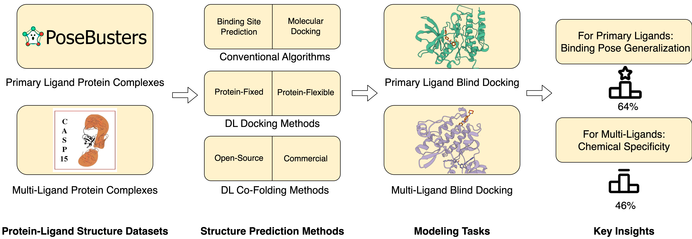

.. PoseBench documentation master file, created by
   sphinx-quickstart on Sun May 12 14:49:07 2024.
   You can adapt this file completely to your liking, but it should at least
   contain the root `toctree` directive.

Welcome to PoseBench's documentation!
============================================

.. mdinclude:: ../../README.md
    :start-line: 3
    :end-line: 9

.. mdinclude:: ../../README.md
    :start-line: 16
    :end-line: 18

.. toctree::
   :maxdepth: 2
   :caption: Contents:

   installation
   tutorials
   data_preparation
   available_methods
   method_inference
   ensemble_inference
   comparative_plots
   for_developers
   acknowledgements
   citing_this_work
   bonus

.. toctree::
   :glob:
   :maxdepth: 2
   :hidden:
   :caption: Default Configs

   configs/analysis
   configs/data
   configs/model

.. toctree::
   :glob:
   :maxdepth: 1
   :hidden:
   :caption: API Reference

   modules/complex_alignment
   modules/inference_relaxation
   modules/minimize_energy
   modules/ensemble_generation
   modules/data_utils
   modules/model_utils
   modules/utils
   modules/resolvers

Indices and tables
==================

* :ref:`genindex`
* :ref:`modindex`
* :ref:`search`
