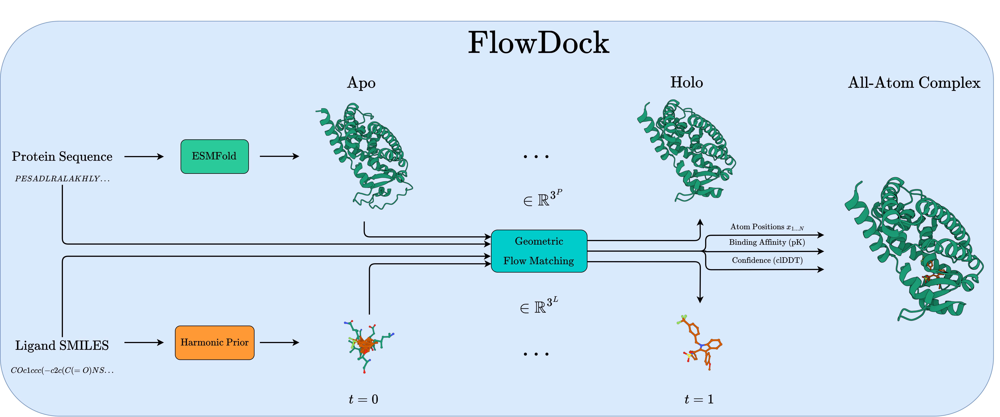

<div align="center">

# FlowDock

<a href="https://pytorch.org/get-started/locally/"></a>
<a href="https://pytorchlightning.ai/"></a>
<a href="https://hydra.cc/"></a>
<a href="https://github.com/ashleve/lightning-hydra-template"></a><br>

<!-- [](https://www.nature.com/articles/nature14539) -->

<!-- [](https://papers.nips.cc/paper/2020) -->



</div>

## Description

Official implementation of "FlowDock: Geometric Flow Matching for Generative Protein-Ligand Docking and Affinity Prediction".

## Contents

- [Installation](#installation)
- [How to prepare data for FlowDock](#how-to-prepare-data-for-flowdock)
- [How to train FlowDock](#how-to-train-flowdock)
- [How to evaluate FlowDock](#how-to-evaluate-flowdock)
- [How to create comparative plots of evaluation results](#how-to-create-comparative-plots-of-evaluation-results)
- [How to predict new protein-ligand complex structures and their affinities using FlowDock](#how-to-predict-new-protein-ligand-complex-structures-using-flowdock)
- [For developers](#for-developers)
- [Acknowledgements](#acknowledgements)
- [Citing this work](#citing-this-work)

## Installation

<details>

Install Mamba

```bash
wget "https://github.com/conda-forge/miniforge/releases/latest/download/Miniforge3-$(uname)-$(uname -m).sh"
bash Miniforge3-$(uname)-$(uname -m).sh  # accept all terms and install to the default location
rm Miniforge3-$(uname)-$(uname -m).sh  # (optionally) remove installer after using it
source ~/.bashrc  # alternatively, one can restart their shell session to achieve the same result
```

Install dependencies

```bash
# clone project
git clone https://github.com/BioinfoMachineLearning/FlowDock
cd FlowDock

# create conda environment
mamba env create -f environments/flowdock_environment.yaml
conda activate FlowDock  # NOTE: one still needs to use `conda` to (de)activate environments
pip3 install -e . # install local project as package
```

Download checkpoints

```bash
# pretrained NeuralPLexer weights
cd checkpoints/
wget https://zenodo.org/records/10373581/files/neuralplexermodels_downstream_datasets_predictions.zip
unzip neuralplexermodels_downstream_datasets_predictions.zip
rm neuralplexermodels_downstream_datasets_predictions.zip
cd ../
```

```bash
# pretrained FlowDock weights
cd checkpoints/
wget https://zenodo.org/records/10373582/files/flowdock_weights.zip
unzip flowdock_weights.zip
rm flowdock_weights.zip
cd ../
```

</details>

## How to prepare data for `FlowDock`

<details>

**NOTE:** The following steps are only necessary if one wants to manually process each of the following datasets.
Otherwise, preprocessed versions of each dataset can be found on [Zenodo](https://zenodo.org/records/10373582).

Download data

```bash
# fetch preprocessed PDBBind, Binding MOAD & DockGen, as well as van der Mers (vdM) datasets
cd data/

wget https://zenodo.org/record/6408497/files/PDBBind.zip
wget https://zenodo.org/records/10656052/files/BindingMOAD_2020_processed.tar
wget https://zenodo.org/records/10656052/files/DockGen.tar
wget https://files.ipd.uw.edu/pub/training_sets/pdb_2021aug02.tar.gz

unzip PDBBind.zip
tar -xf BindingMOAD_2020_processed.tar
tar -xf DockGen.tar
tar -xzf pdb_2021aug02.tar.gz

rm PDBBind.zip BindingMOAD_2020_processed.tar DockGen.tar pdb_2021aug02.tar.gz

mkdir pdbbind/ moad/ pdbsidechain/
mv PDBBind_processed/ pdbbind/
mv BindingMOAD_2020_processed/ moad/
mv pdb_2021aug02/ pdbsidechain/

cd ../
```

### Generating ESM2 embeddings for each protein

To generate the ESM2 embeddings for the protein inputs,
first create all the corresponding FASTA files for each protein sequence

```bash
python flowdock/data/components/esm_embedding_preparation.py --dataset pdbbind --data_dir data/pdbbind/PDBBind_processed/ --out_file data/pdbbind/pdbbind_sequences.fasta
python flowdock/data/components/esm_embedding_preparation.py --dataset moad --data_dir data/moad/BindingMOAD_2020_processed/pdb_protein/ --out_file data/moad/moad_sequences.fasta
python flowdock/data/components/esm_embedding_preparation.py --dataset dockgen --data_dir data/DockGen/processed_files/ --out_file data/DockGen/dockgen_sequences.fasta
python flowdock/data/components/esm_embedding_preparation.py --dataset pdbsidechain --data_dir data/pdbsidechain/pdb_2021aug02/pdb/ --out_file data/pdbsidechain/pdbsidechain_sequences.fasta
```

Then, generate all ESM2 embeddings in batch using the ESM repository's helper script

```bash
python flowdock/data/components/esm_embedding_extraction.py esm2_t33_650M_UR50D data/pdbbind/pdbbind_sequences.fasta data/pdbbind/embeddings_output --repr_layers 33 --include per_tok --truncation_seq_length 4096 --cuda_device_index 0
python flowdock/data/components/esm_embedding_extraction.py esm2_t33_650M_UR50D data/moad/moad_sequences.fasta data/moad/embeddings_output --repr_layers 33 --include per_tok --truncation_seq_length 4096 --cuda_device_index 0
python flowdock/data/components/esm_embedding_extraction.py esm2_t33_650M_UR50D data/DockGen/dockgen_sequences.fasta data/DockGen/embeddings_output --repr_layers 33 --include per_tok --truncation_seq_length 4096 --cuda_device_index 0
python flowdock/data/components/esm_embedding_extraction.py esm2_t33_650M_UR50D data/pdbsidechain/pdbsidechain_sequences.fasta data/pdbsidechain/embeddings_output --repr_layers 33 --include per_tok --truncation_seq_length 4096 --cuda_device_index 0
```

### Predicting apo protein structures using ESMFold

To generate the apo version of each protein structure,
first create ESMFold-ready versions of the combined FASTA files
prepared above by the script `esm_embedding_preparation.py`
for the PDBBind, Binding MOAD, DockGen, and PDBSidechain datasets, respectively

```bash
python flowdock/data/components/esmfold_sequence_preparation.py dataset=pdbbind
python flowdock/data/components/esmfold_sequence_preparation.py dataset=moad
python flowdock/data/components/esmfold_sequence_preparation.py dataset=dockgen
python flowdock/data/components/esmfold_sequence_preparation.py dataset=pdbsidechain
```

Then, predict each apo protein structure using ESMFold's batch
inference script

```bash
# Note: Having a CUDA-enabled device available when running this script is highly recommended
python flowdock/data/components/esmfold_batch_structure_prediction.py -i data/pdbbind/pdbbind_esmfold_sequences.fasta -o data/pdbbind/pdbbind_esmfold_structures --cuda-device-index 0 --skip-existing
python flowdock/data/components/esmfold_batch_structure_prediction.py -i data/moad/moad_esmfold_sequences.fasta -o data/moad/moad_esmfold_structures --cuda-device-index 0 --skip-existing
python flowdock/data/components/esmfold_batch_structure_prediction.py -i data/DockGen/dockgen_esmfold_sequences.fasta -o data/DockGen/dockgen_esmfold_structures --cuda-device-index 0 --skip-existing
python flowdock/data/components/esmfold_batch_structure_prediction.py -i data/pdbsidechain/pdbsidechain_esmfold_sequences.fasta -o data/pdbsidechain/pdbsidechain_esmfold_structures --cuda-device-index 0 --skip-existing
```

Align each apo protein structure to its corresponding
holo protein structure counterpart in PDBBind, Binding MOAD, and PDBSidechain,
taking ligand conformations into account during each alignment

```bash
python flowdock/data/components/esmfold_apo_to_holo_alignment.py dataset=pdbbind num_workers=1
python flowdock/data/components/esmfold_apo_to_holo_alignment.py dataset=moad num_workers=1
python flowdock/data/components/esmfold_apo_to_holo_alignment.py dataset=dockgen num_workers=1
python flowdock/data/components/esmfold_apo_to_holo_alignment.py dataset=pdbsidechain num_workers=1
```

Lastly, assess the apo-to-holo alignments in terms of statistics and structural metrics
to enable runtime-dynamic dataset filtering using such information

```bash
python flowdock/data/components/esmfold_apo_to_holo_assessment.py dataset=pdbbind usalign_exec_path=$MY_USALIGN_EXEC_PATH
python flowdock/data/components/esmfold_apo_to_holo_assessment.py dataset=moad usalign_exec_path=$MY_USALIGN_EXEC_PATH
python flowdock/data/components/esmfold_apo_to_holo_assessment.py dataset=dockgen usalign_exec_path=$MY_USALIGN_EXEC_PATH
python flowdock/data/components/esmfold_apo_to_holo_assessment.py dataset=pdbsidechain usalign_exec_path=$MY_USALIGN_EXEC_PATH
```

</details>

## How to train `FlowDock`

<details>

Train model with default configuration

```bash
# train on CPU
python flowdock/train.py trainer=cpu

# train on GPU
python flowdock/train.py trainer=gpu
```

Train model with chosen experiment configuration from [configs/experiment/](configs/experiment/)

```bash
python flowdock/train.py experiment=experiment_name.yaml
```

For example, reproduce `FlowDock`'s default model training run

```bash
python flowdock/train.py experiment=flowdock_fm
```

**Note:** You can override any parameter from command line like this

```bash
python flowdock/train.py experiment=flowdock_fm trainer.max_epochs=20 data.batch_size=8
```

For example, override parameters to finetune `FlowDock`'s pretrained weights using a new dataset

```bash
python flowdock/train.py experiment=flowdock_fm data=my_new_datamodule ckpt_path=checkpoints/esmfold_prior_paper_weights.ckpt
```

</details>

## How to evaluate `FlowDock`

<details>

To reproduce `FlowDock`'s evaluation results for structure prediction, please refer to its documentation in the [PoseBench](https://github.com/BioinfoMachineLearning/PoseBench?tab=readme-ov-file#how-to-run-inference-with-flowdock) GitHub repository.

To reproduce `FlowDock`'s evaluation results for binding affinity prediction using the PDBBind dataset

```bash
python flowdock/eval.py data.test_datasets=[pdbbind] ckpt_path=checkpoints/esmfold_prior_paper_weights_EMA.ckpt trainer=gpu
... # re-run two more times to gather triplicate results
```

</details>

## How to create comparative plots of structure prediction results

<details>

```bash
jupyter notebook notebooks/structure_prediction_results_plotting.ipynb
```

</details>

## How to predict new protein-ligand complex structures and their affinities using `FlowDock`

<details>

For example, generate new protein-ligand complexes for a pair of protein sequence and ligand SMILES strings such as those of the PDBBind 2020 test target `6i67`

```bash
python flowdock/sample.py ckpt_path=checkpoints/esmfold_prior_paper_weights_EMA.ckpt model.cfg.prior_type=esmfold sampling_task=batched_structure_sampling input_receptor='YNKIVHLLVAEPEKIYAMPDPTVPDSDIKALTTLCDLADRELVVIIGWAKHIPGFSTLSLADQMSLLQSAWMEILILGVVYRSLFEDELVYADDYIMDEDQSKLAGLLDLNNAILQLVKKYKSMKLEKEEFVTLKAIALANSDSMHIEDVEAVQKLQDVLHEALQDYEAGQHMEDPRRAGKMLMTLPLLRQTSTKAVQHFYNKLEGKVPMHKLFLEMLEAKV' input_ligand='"c1cc2c(cc1O)CCCC2"' input_template=data/pdbbind/pdbbind_holo_aligned_esmfold_structures/6i67_holo_aligned_esmfold_protein.pdb sample_id='6i67' out_path='./6i67_sampled_structures/' n_samples=5 chunk_size=5 num_steps=40 sampler=VDODE sampler_eta=1.0 start_time='1.0' use_template=true separate_pdb=true visualize_sample_trajectories=true auxiliary_estimation_only=false esmfold_chunk_size=null trainer=gpu
```

Or, for example, generate new protein-ligand complexes for pairs of protein sequences and (multi-)ligand SMILES strings (delimited via `|`) such as those of the CASP15 target `T1152`

```bash
python flowdock/sample.py ckpt_path=checkpoints/esmfold_prior_paper_weights_EMA.ckpt model.cfg.prior_type=esmfold sampling_task=batched_structure_sampling input_receptor='MYTVKPGDTMWKIAVKYQIGISEIIAANPQIKNPNLIYPGQKINIP|MYTVKPGDTMWKIAVKYQIGISEIIAANPQIKNPNLIYPGQKINIP|MYTVKPGDTMWKIAVKYQIGISEIIAANPQIKNPNLIYPGQKINIPN' input_ligand='"CC(=O)NC1C(O)OC(CO)C(OC2OC(CO)C(OC3OC(CO)C(O)C(O)C3NC(C)=O)C(O)C2NC(C)=O)C1O"' input_template=data/test_cases/predicted_structures/T1152.pdb sample_id='T1152' out_path='./T1152_sampled_structures/' n_samples=5 chunk_size=5 num_steps=40 sampler=VDODE sampler_eta=1.0 start_time='1.0' use_template=true separate_pdb=true visualize_sample_trajectories=true auxiliary_estimation_only=false esmfold_chunk_size=null trainer=gpu
```

If you do not already have a template protein structure available for your target of interest, set `input_template=null` to instead have the sampling script predict the ESMFold structure of your provided `input_protein` sequence before running the sampling pipeline. For more information regarding the input arguments available for sampling, please refer to the config at `configs/sample.yaml`.

</details>

## For developers

<details>

Set up `pre-commit` (one time only) for automatic code linting and formatting upon each `git commit`

```bash
pre-commit install
```

Manually reformat all files in the project, as desired

```bash
pre-commit run -a
```

Update dependencies in a `*_environment.yml` file

```bash
mamba env export > env.yaml # e.g., run this after installing new dependencies locally
diff environments/flowdock_environment.yaml env.yaml # note the differences and copy accepted changes back into e.g., `environments/flowdock_environment.yaml`
rm env.yaml # clean up temporary environment file
```

</details>

## Acknowledgements

`FlowDock` builds upon the source code and data from the following projects:

- [DiffDock](https://github.com/gcorso/DiffDock)
- [lightning-hydra-template](https://github.com/ashleve/lightning-hydra-template)
- [NeuralPLexer](https://github.com/zrqiao/NeuralPLexer)

We thank all their contributors and maintainers!

## Citing this work

If you use the code associated with this repository or otherwise find this work useful, please cite:

```bibtex
@article{morehead2024flowdock,
  title={FlowDock: Geometric Flow Matching for Generative Protein-Ligand Docking and Affinity Prediction},
  author={Morehead, Alex and Cheng, Jianlin},
  year={2024}
}
```
