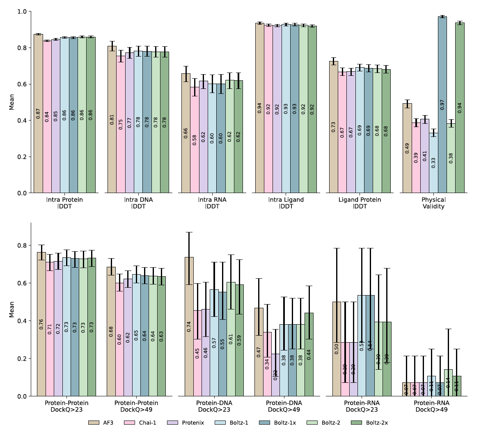

<div align="center">
  <div>&nbsp;</div>
  
  

[Boltz-1](https://doi.org/10.1101/2024.11.19.624167) | [Boltz-2](https://doi.org/10.1101/2025.06.14.659707) |
[Slack](https://boltz.bio/join-slack) | Commit: `ac33fe07eb8336c5046b740ffeedf1345fcb00af` <br> <br>
</div>


## Introduction

Boltz is a family of models for biomolecular interaction prediction. Boltz-1 was the first fully open source model to approach AlphaFold3 accuracy. Our latest work Boltz-2 is a new biomolecular foundation model that goes beyond AlphaFold3 and Boltz-1 by jointly modeling complex structures and binding affinities, a critical component towards accurate molecular design. Boltz-2 is the first deep learning model to approach the accuracy of physics-based free-energy perturbation (FEP) methods, while running 1000x faster — making accurate in silico screening practical for early-stage drug discovery.

All the code and weights are provided under MIT license, making them freely available for both academic and commercial uses. For more information about the model, see the [Boltz-1](https://doi.org/10.1101/2024.11.19.624167) and [Boltz-2](https://doi.org/10.1101/2025.06.14.659707) technical reports. To discuss updates, tools and applications join our [Slack channel](https://boltz.bio/join-slack).

## Installation

> Note: we recommend installing boltz in a fresh python environment

Install boltz with PyPI (recommended):

```
pip install boltz[cuda] -U
```

or directly from GitHub for daily updates:

```
git clone https://github.com/jwohlwend/boltz.git
cd boltz; pip install -e .[cuda]
```

If you are installing on CPU-only or non-CUDA GPus hardware, remove `[cuda]` from the above commands. Note that the CPU version is significantly slower than the GPU version.

## Inference

You can run inference using Boltz with:

```
boltz predict input_path --use_msa_server
```

`input_path` should point to a YAML file, or a directory of YAML files for batched processing, describing the biomolecules you want to model and the properties you want to predict (e.g. affinity). To see all available options: `boltz predict --help` and for more information on these input formats, see our [prediction instructions](docs/prediction.md). By default, the `boltz` command will run the latest version of the model.


### Binding Affinity Prediction
There are two main predictions in the affinity output: `affinity_pred_value` and `affinity_probability_binary`. They are trained on largely different datasets, with different supervisions, and should be used in different contexts. The `affinity_probability_binary` field should be used to detect binders from decoys, for example in a hit-discovery stage. It's value ranges from 0 to 1 and represents the predicted probability that the ligand is a binder. The `affinity_pred_value` aims to measure the specific affinity of different binders and how this changes with small modifications of the molecule. This should be used in ligand optimization stages such as hit-to-lead and lead-optimization. It reports a binding affinity value as `log(IC50)`, derived from an `IC50` measured in `μM`. More details on how to run affinity predictions and parse the output can be found in our [prediction instructions](docs/prediction.md).

## Authentication to MSA Server

When using the `--use_msa_server` option with a server that requires authentication, you can provide credentials in one of two ways. More information is available in our [prediction instructions](docs/prediction.md).
 
## Evaluation

⚠️ **Coming soon: updated evaluation code for Boltz-2!**

To encourage reproducibility and facilitate comparison with other models, on top of the existing Boltz-1 evaluation pipeline, we will soon provide the evaluation scripts and structural predictions for Boltz-2, Boltz-1, Chai-1 and AlphaFold3 on our test benchmark dataset, and our affinity predictions on the FEP+ benchmark, CASP16 and our MF-PCBA test set.





## Training

⚠️ **Coming soon: updated training code for Boltz-2!**

If you're interested in retraining the model, currently for Boltz-1 but soon for Boltz-2, see our [training instructions](docs/training.md).


## Contributing

We welcome external contributions and are eager to engage with the community. Connect with us on our [Slack channel](https://boltz.bio/join-slack) to discuss advancements, share insights, and foster collaboration around Boltz-2.

On recent NVIDIA GPUs, Boltz leverages the acceleration provided by [NVIDIA  cuEquivariance](https://developer.nvidia.com/cuequivariance) kernels. Boltz also runs on Tenstorrent hardware thanks to a [fork](https://github.com/moritztng/tt-boltz) by Moritz Thüning.

## License

Our model and code are released under MIT License, and can be freely used for both academic and commercial purposes.


## Cite

If you use this code or the models in your research, please cite the following papers:

```bibtex
@article{passaro2025boltz2,
  author = {Passaro, Saro and Corso, Gabriele and Wohlwend, Jeremy and Reveiz, Mateo and Thaler, Stephan and Somnath, Vignesh Ram and Getz, Noah and Portnoi, Tally and Roy, Julien and Stark, Hannes and Kwabi-Addo, David and Beaini, Dominique and Jaakkola, Tommi and Barzilay, Regina},
  title = {Boltz-2: Towards Accurate and Efficient Binding Affinity Prediction},
  year = {2025},
  doi = {10.1101/2025.06.14.659707},
  journal = {bioRxiv}
}

@article{wohlwend2024boltz1,
  author = {Wohlwend, Jeremy and Corso, Gabriele and Passaro, Saro and Getz, Noah and Reveiz, Mateo and Leidal, Ken and Swiderski, Wojtek and Atkinson, Liam and Portnoi, Tally and Chinn, Itamar and Silterra, Jacob and Jaakkola, Tommi and Barzilay, Regina},
  title = {Boltz-1: Democratizing Biomolecular Interaction Modeling},
  year = {2024},
  doi = {10.1101/2024.11.19.624167},
  journal = {bioRxiv}
}
```

In addition if you use the automatic MSA generation, please cite:

```bibtex
@article{mirdita2022colabfold,
  title={ColabFold: making protein folding accessible to all},
  author={Mirdita, Milot and Sch{\"u}tze, Konstantin and Moriwaki, Yoshitaka and Heo, Lim and Ovchinnikov, Sergey and Steinegger, Martin},
  journal={Nature methods},
  year={2022},
}
```
