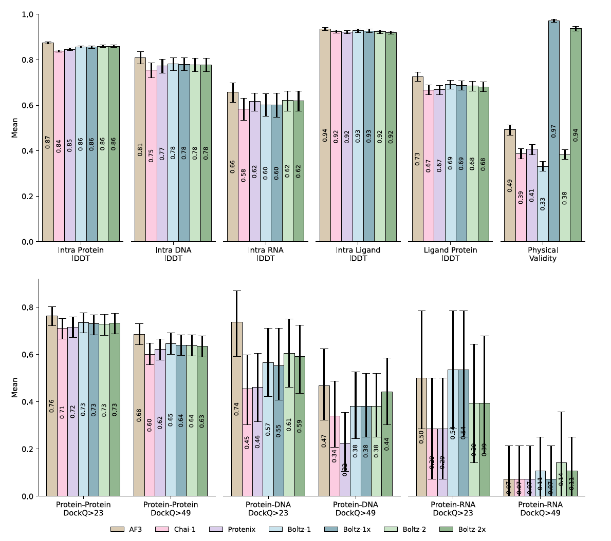
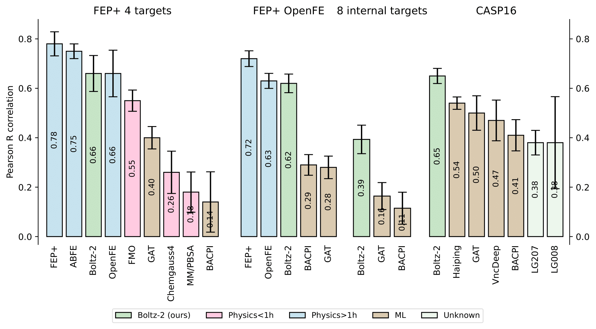

# Evaluation

To encourage reproducibility and facilitate comparison with other models, we will provide the evaluation scripts and structural predictions for Boltz-2, Boltz-1, Chai-1 and AlphaFold3 on our test benchmark dataset, and our affinity predictions on the FEP+ benchamark, CASP16 and our MF-PCBA test set.





## Evaluation files
⚠️ **Coming soon updated evaluation files for Boltz-2!**


## Evaluation setup
⚠️ **Coming soon updated setup for Boltz-2!**


## Evaluation script
⚠️ **Coming soon updated evaluation scripts for Boltz-2!**

# Evaluation

To encourage reproducibility and facilitate comparison with other models, we provide the evaluation scripts and predictions for Boltz-1, Chai-1, and AlphaFold3 on our test benchmark dataset as well as CASP15. These datasets are created to contain biomolecules different from the training data and to benchmark the performance of these models we run them with the same input MSAs and the same number of recycling and diffusion steps.


## (Old) Boltz-1 Evaluation files

You can download all the MSAs, input files, output files and evaluation outputs for Boltz-1, Boltz-1x, Chai-1, and AlphaFold3 from this [Google Drive folder](https://drive.google.com/file/d/1JvHlYUMINOaqPTunI9wBYrfYniKgVmxf/view?usp=sharing). 

The files are organized as follows:

```
boltz_results_final/
├── inputs/                 # Input files for every model
    ├── casp15/
        ├── af3
        ├── boltz
        ├── boltzx
        ├── chai
        └── msa
    └── test/
├── targets/                # Target files from PDB
    ├── casp15
    └── test
├── outputs/                # Output files for every model
    ├── casp15
    └── test
├── evals/                  # Output of evaluation script for every
    ├── casp15
    └── test
├── results_casp.csv        # Summary of evaluation results for CASP15
└── results_test.csv        # Summary of evaluation results for test set
```

## (Old) Boltz-1 Evaluation setup

We evaluate the model on two datasets:
 - PDB test set: 541 targets after our validation cut-off date and at most 40% sequence similarity for proteins, 80% Tanimoto for ligands.
 - CASP15: 66 difficult targets from the CASP 2022 competition. 

We benchmark Boltz-1 against Chai-1 and AF3, other state-of-the-art structure prediction models, but much more closed source in terms of model code, training and data pipeline. Note that we remove overlap with our validation set, but we cannot ensure that there is no overlap with AF3 or Chai-1 validation set as those were not published. 

For fair comparison we compare the models with the following setup:
 - Same MSA’s.
 - Same parameters: 10 recycling steps, 200 sampling steps, 5 samples.
 - We compare our oracle and top-1 numbers among the 5 samples.


## (Old) Boltz-1 Evaluation script

We also provide the scripts we used to evaluate the models and aggregate results. The evaluations were run through [OpenStructure](https://openstructure.org/docs/2.9.0/) version 2.8.0 (it is important to use the specific version for reproducing the results). You can find these scripts at `scripts/eval/run_evals.py` and `scripts/eval/aggregate_evals.py`.
